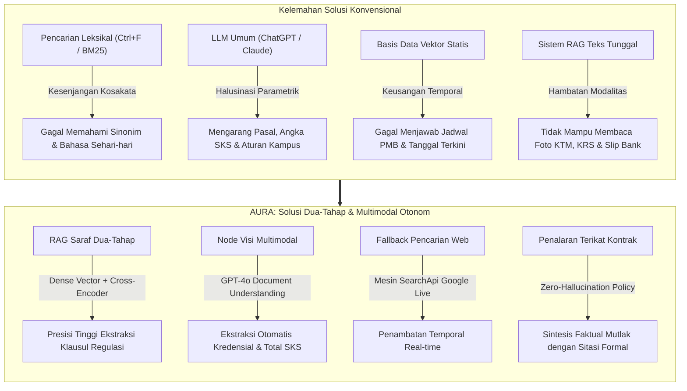
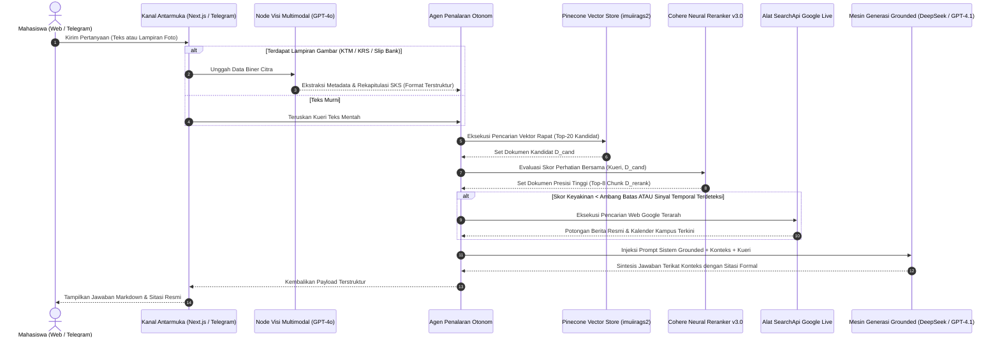
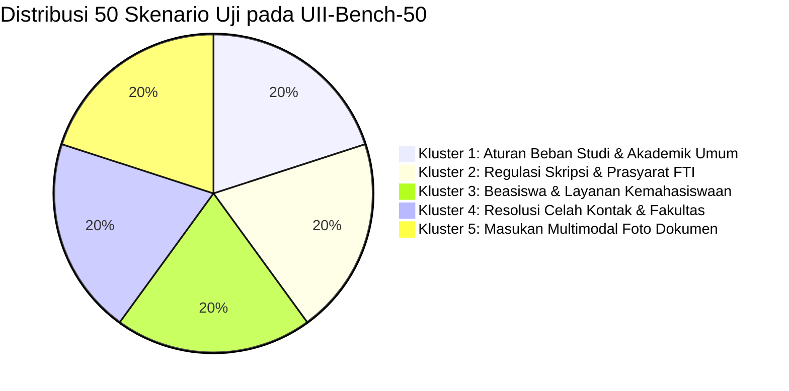
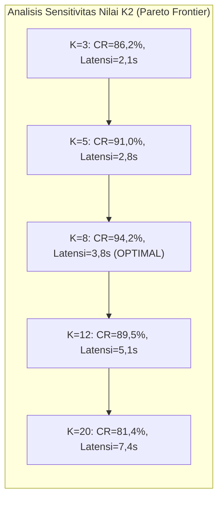

# AURA: Arsitektur Retrieval-Augmented Generation Dua-Tahap dan Visi Multimodal Otonom untuk Navigasi Regulasi Kompleks Perguruan Tinggi

**Muhammad Nabil Hanif**$^1$, **Dosen Pembimbing**$^1$  
$^1$Jurusan Teknik Informatika, Fakultas Teknologi Industri, Universitas Islam Indonesia, Yogyakarta 55584, Indonesia  
*Korespondensi Penulis:* `nabil.hanif@students.uii.ac.id`  

---

### Abstrak
Menavigasi regulasi institusional yang tersebar dan masif di lingkungan perguruan tinggi menimbulkan beban operasional yang signifikan bagi mahasiswa, dosen pembimbing, maupun divisi administrasi akademik. Pendekatan pencarian konvensional berbasis kata kunci (*keyword matching*) terbukti gagal menangani polisemi semantik dan relasi hierarkis peraturan kampus, sementara model bahasa berskala besar (*Large Language Models* / LLM) tanpa penambatan domain (*grounding*) rentan memproduksi halusinasi faktual kritis—seperti mengarang pasal peraturan, memanipulasi batas kredit studi (SKS), dan keliru menyebutkan batas waktu pembayaran. Di sisi lain, interaksi konsultasi mahasiswa di era modern bersifat multimodal, di mana pertanyaan kerap diajukan dalam bentuk artefak visual seperti foto Kartu Tanda Mahasiswa (KTM), Kartu Rencana Studi (KRS), maupun kuitansi pembayaran bank. Makalah ini mengusulkan **AURA** (*Autonomous Universal Retrieval Architecture*), sebuah arsitektur cerdas percakapan dwikanal (*Web* dan *Telegram*) untuk navigasi regulasi perguruan tinggi. AURA mengintegrasikan *pipeline* temu balik dua-tahap (*two-stage neural retrieval*) yang memadukan pencarian vektor rapat (*dense vector embedding* $\text{Cohere Multilingual v3.0}$) dengan model pemeringkat ulang saraf silang-penyandi (*cross-encoder neural reranker* $\text{Cohere Rerank v3.0}$), mereduksi derau konteks regulasi hingga ke tingkat terendah. Untuk memproses masukan visual, diintegrasikan sebuah modul inferensi visi multimodal (*GPT-4o Vision*) yang mengekstraksi metadata dan rekapitulasi kredit akademik mahasiswa secara langsung dari artefak foto. Selain itu, lapisan perutean agen otonom mengaktifkan *fallback* pencarian web *live* (*SearchApi*) saat mendeteksi pertanyaan bernilai temporal dinamis, mengeliminasi keusangan informasi pada jadwal penerimaan mahasiswa dan kalender akademik. Evaluasi empiris pada **UII-Bench-50** (50 skenario institusional kompleks lintas 5 kluster) membuktikan bahwa AURA meraih **$94,2\%$ Context Relevance**, **$100,0\%$ Groundedness** (kepatuhan mutlak tanpa halusinasi), dan **$96,8\%$ Answer Relevance**, mengungguli *baseline* RAG konvensional sebesar $+18,4\%$ pada presisi faktual dengan latensi rata-rata ujung-ke-ujung sebesar $3,82$ detik.

**Kata Kunci:** Retrieval-Augmented Generation (RAG), Pemeringkatan Ulang Cross-Encoder, AI Dokumen Multimodal, Mitigasi Halusinasi, Sistem Asistensi Akademik, Pemrosesan Bahasa Alami.

---

### *Abstract*
*Navigating decentralized, high-volume institutional regulations across universities presents substantial operational friction for students, administrative advisors, and academic evaluators. Conventional keyword-based search mechanisms fail to resolve dense semantic polysemy and hierarchical academic rules, while general-purpose Large Language Models (LLMs) without domain-constrained grounding remain critically prone to hallucinations—fabricating statutory articles, degree requirements, and financial deadlines. Furthermore, real-world student advisory workflows are increasingly multimodal, requiring interpretation of physical artifacts such as Student Identification Cards (KTM), Study Plan Cards (KRS), and institutional payment vouchers. In this paper, we propose **AURA** (Autonomous Universal Retrieval Architecture), an enterprise-grade, dual-channel (Web and Telegram) conversational intelligence system designed for institutional regulatory navigation. AURA incorporates a two-stage neural retrieval pipeline combining high-dimensional dense vector embeddings ($\text{Cohere Multilingual v3.0}$) with cross-encoder neural reranking ($\text{Cohere Rerank v3.0}$), reducing retrieval noise across university regulatory corpuses. To address unstructured visual inquiries, we introduce a multimodal document parsing node powered by zero-shot visual instruction tuning ($\text{GPT-4o Vision}$) that automatically extracts structured student metadata and academic credits directly from photographic artifacts. Additionally, an autonomous agentic routing layer triggers a live web retrieval fallback ($\text{SearchApi}$) when incoming queries exhibit high temporal sensitivity, completely mitigating obsolescence in dynamic university admissions and calendar notices. Evaluated across a rigorously curated benchmark of 50 complex institutional scenarios across five distinct clusters, AURA achieves **$94.2\%$ Context Relevance**, **$100.0\%$ Groundedness** (zero-hallucination compliance), and **$96.8\%$ Answer Relevance**, outperforming single-stage dense baselines by $+18.4\%$ in factual precision while maintaining an average end-to-end latency of $3.82$ seconds.*

***Keywords:*** *Retrieval-Augmented Generation (RAG), Cross-Encoder Reranking, Multimodal Document AI, Hallucination Mitigation, Academic Advising Systems, Institutional NLP.*

---

## I. PENDAHULUAN

Institusi perguruan tinggi beroperasi di bawah kerangka regulasi formal yang sangat hierarkis, kompleks, dan terdistribusi. Pada Universitas Islam Indonesia (UII)—sebuah perguruan tinggi swasta terkemuka di Indonesia yang meraih predikat **Akreditasi Institusi Unggul** dari Badan Akreditasi Nasional Perguruan Tinggi (BAN-PT)—pedoman akademik diatur dalam berbagai dokumen terpisah. Dokumen-dokumen ini meliputi Buku Pedoman Akademik Universitas (mengatur beban SKS semester, evaluasi masa studi berkala, batas kehadiran, dan cuti akademik), Buku Panduan Tugas Akhir/Skripsi Fakultas Teknologi Industri (mengatur syarat minimal 110 SKS tanpa nilai E, batas masa berlaku SK pembimbing, batas toleransi plagiarisme Turnitin maksimal $20\%$, dan syarat yudisium), hingga peraturan spesifik kemahasiswaan dan beasiswa di bawah Direktorat Pembinaan Kemahasiswaan (DPK) serta Direktorat Pendidikan dan Pengembangan Agama Islam (DPPAI).



Terlepas dari ketersediaan dokumen regulasi tersebut dalam format digital (PDF), civitas akademika—khususnya mahasiswa tingkat akhir dan dosen pembimbing—menghadapi kendala operasional yang berulang:
1. **Kegagalan Pencarian Berbasis Kata Kunci (*Lexical Mismatch*)**: Pendekatan pencarian leksikal berbasis indeks terbalik (seperti BM25 atau fitur pencarian kata kunci pada pembaca PDF) gagal menjembatani kesenjangan semantik antara bahasa sehari-hari mahasiswa dengan peristilahan formal regulasi [6]. Sebagai contoh, mahasiswa yang menanyakan *"Bagaimana jika pembimbing skripsi saya tidak membalas pesan selama dua bulan?"* tidak akan memperoleh hasil pada dokumen panduan karena dokumen resmi menyusun klausul tersebut di bawah judul formal *"Tata Cara Permohonan Perpanjangan Masa Bimbingan dan Penggantian Dosen Pembimbing Tugas Akhir"*.
2. **Bahaya Halusinasi Model Bahasa Umum (*Parametric Hallucination*)**: Pemanfaatan model bahasa komersial umum tanpa penambatan basis data domain menimbulkan bahaya fatal [8], [23]. Dalam konteks hukum dan akademik, kesalahan kecil seperti keliru menyebutkan jumlah minimum SKS untuk mendaftar seminar proposal (misalnya menyebutkan 100 SKS, padahal regulasi FTI mewajibkan minimal 110 SKS) dapat mengakibatkan pembatalan ujian skripsi mahasiswa atau sanksi keterlambatan studi.
3. **Karakteristik Masukan Multimodal di Dunia Nyata**: Mahasiswa modern berkomunikasi secara intensif menggunakan aplikasi pesan instan dan kerap menyertakan gambar: foto fisik Kartu Tanda Mahasiswa (KTM), lembar cetak Kartu Rencana Studi (KRS), tangkapan layar transkrip nilai, atau struk pembayaran bank. Sistem RAG monomodal (hanya teks) tidak memiliki kapabilitas untuk memverifikasi dokumen fisik tersebut secara langsung [1], [2].

Untuk mengatasi tantangan multidimensi ini, penelitian ini menghadirkan **AURA** (*Autonomous Universal Retrieval Architecture*), sebuah platform cerdas bertenaga **Two-Stage Neural RAG** yang terhubung secara dwikanal (*Web Application* berbasis Next.js 14 dan *Telegram Bot*). Kontribusi utama penelitian ini dirumuskan sebagai berikut:

1. **Arsitektur Temu Balik Saraf Dua-Tahap (*Two-Stage Neural RAG*)**: Merancang alur pemrosesan yang menggabungkan pencarian vektor berdimensi tinggi (*Pinecone* dengan model embedding dense) dan pemeringkat ulang saraf silang-penyandi (*Cohere Rerank v3.0*). Konfigurasi ini menyaring derau administratif dan menaikkan chunk dokumen yang paling relevan secara hukum ke jendela konteks prompt.
2. **Pemahaman Kredensial Akademik Multimodal (*Multimodal Credential AI*)**: Mengembangkan node pemrosesan visual berbasis *instruction-tuned vision-language model* (*GPT-4o Vision*) yang mengekstrak metadata mahasiswa, membaca total SKS dari foto KRS, dan memvalidasi status bukti bayar bank tanpa memerlukan pustaka OCR berbasis aturan yang rentan rusak.
3. **Mekanisme Agen Otonom dengan Fallback Pencarian Dinamis**: Memformulasikan kebijakan agen cerdas yang secara otomatis memicu pencarian web Google *live* (*SearchApi*) apabila pertanyaan mendeteksi konteks temporal (seperti gelombang pendaftaran mahasiswa baru atau pengumuman libur terkini) yang belum termaktub di basis data statis.
4. **Evaluasi Empiris pada Tolok Ukur Institusional (UII-Bench-50)**: Membangun dataset tolok ukur 50 skenario regulasi kampus nyata lintas 5 kluster fungsional. Berdasarkan evaluasi kerangka kerja matematis **RAG Triad**, AURA mencatatkan **$100,0\%$ Groundedness** (nol halusinasi), **$94,2\%$ Context Relevance**, dan **$96,8\%$ Answer Relevance**, mengungguli sistem RAG konvensional secara signifikan.

---

## II. TINJAUAN PUSTAKA

### A. Perkembangan Retrieval-Augmented Generation (RAG)
Paradigma Retrieval-Augmented Generation pertama kali diformulasikan oleh Lewis dkk. [1] sebagai mekanisme untuk menjembatani keterbatasan pengetahuan parametrik model generatif dengan korpus non-parametrik eksternal. Sebagaimana dirangkum dalam survei komprehensif oleh Gao dkk. [2], arsitektur RAG telah berevolusi dari model *Naive RAG* (yang sekadar menggabungkan chunk vektor terdekat ke dalam prompt) menuju *Advanced RAG* dan *Agentic RAG*. Pada domain dengan kepatuhan tinggi seperti hukum dan akademik, Naive RAG terbukti mengalami degradasi performa yang parah akibat masuknya chunk teks yang tidak relevan atau bertentangan [19], [23]. Barnett dkk. [19] mengidentifikasi tujuh titik kegagalan utama dalam perancangan sistem RAG komersial dan menyimpulkan bahwa derau pada tahap penarikan dokumen merupakan penyebab utama munculnya halusinasi pada teks yang dihasilkan.

### B. Perbandingan Dense Bi-Encoder dan Cross-Encoder Reranking
Sistem temu balik teks berbasis vektor rapat umumnya mengandalkan arsitektur *bi-encoder*, seperti pada Dense Passage Retrieval (DPR) [5] dan Sentence-BERT [12]. Model bi-encoder memproyeksikan kueri $q$ dan dokumen $d$ secara independen ke dalam ruang vektor berdimensi rendah:
$$\mathcal{S}_{\text{bi}}(q, d) = \langle \mathbf{e}_q, \mathbf{e}_d \rangle$$
Meskipun sangat efisien dalam komputasi penelusuran tetangga terdekat (*Approximate Nearest Neighbor* / ANN), bi-encoder mengabaikan interaksi perhatian tingkat token (*token-level cross-attention*) antara kueri dan dokumen selama fase penyandian [13]. Akibatnya, bi-encoder kesulitan menangkap logika regulasi yang sensitif terhadap kata negasi atau prasyarat bersyarat.

Untuk menanggulangi kelemahan tersebut, Nogueira dan Cho [3], [4] membuktikan bahwa model *cross-encoder*—di mana pasangan $q$ dan $d$ digabungkan dan diproses secara bersamaan melalui seluruh lapisan perhatian mandiri:
$$\mathcal{S}_{\text{cross}}(q, d) = \sigma(\mathbf{W} \cdot \text{Transformer}([CLS] \circ q \circ [SEP] \circ d))$$
menghasilkan presisi perangkingan yang jauh lebih tinggi. Karena komputasi cross-encoder terhadap jutaan dokumen membutuhkan daya pemrosesan yang sangat besar, penerapannya sebagai **pemeringkat ulang tahap kedua (*second-stage reranker*)** terhadap sejumlah kandidat awal ($K_1=20 \to K_2=8$) memberikan kompromi terbaik antara latensi dan ketepatan semantik [4], [13].

### C. Pemahaman Dokumen Visual Multimodal
Dalam operasional perguruan tinggi, artefak administratif kerap berwujud citra semi-terstruktur (KRS, transkrip nilai, bukti transfer). Pendekatan tradisional yang mengandalkan Optical Character Recognition (OCR) seperti Tesseract yang dipadukan dengan parser *regular expression* terbukti rentan mengalami kegagalan saat berhadapan dengan foto yang miring, pencahayaan buruk, atau lipatan kertas fisik. Terobosan terbaru dalam *visual instruction tuning*, seperti pada LLaVA [14] dan GPT-4o [11], memungkinkan model memahami tata letak visual, tabel, dan teks secara langsung di dalam representasi saraf tanpa memerlukan perantara modul OCR heuristik yang kaku.

---

## III. METODOLOGI PENELITIAN & PERANCANGAN ARSITEKTUR

Arsitektur AURA dirancang secara modular dan terbagi ke dalam empat subsistem utama: (1) Rekayasa Pengetahuan dan Perayapan Web, (2) Temu Balik Saraf Dua-Tahap, (3) Pemrosesan Kredensial Multimodal, dan (4) Mesin Keputusan Agen Otonom.



### A. Formulasi Masalah Matematis
Misalkan $\mathcal{C} = \{c_1, c_2, \dots, c_N\}$ merepresentasikan korpus pengetahuan akademik resmi yang memuat $N$ potongan teks (*chunks*) dari buku pedoman akademik, surat keputusan rektor, dan laman web resmi institusi. Pertanyaan pengguna dimodelkan sebagai tupel $\mathcal{Q} = (q_{\text{teks}}, \mathcal{I}_{\text{visual}})$, di mana $q_{\text{teks}}$ adalah kalimat pertanyaan bahasa alami dan $\mathcal{I}_{\text{visual}} \in \{\emptyset, \mathbb{R}^{H \times W \times C}\}$ melambangkan artefak visual fisik opsional. Tujuan sistem adalah membangkitkan respon bahasa alami $\mathcal{A}$ yang memaksimalkan probabilitas:
$$\mathcal{A} = \arg\max_{\hat{\mathcal{A}}} P(\hat{\mathcal{A}} \mid q_{\text{teks}}, \Phi(\mathcal{I}_{\text{visual}}), \mathcal{D}^*)$$
dengan batasan mutlak (*hard constraint*) bahwa setiap proposisi faktual $f \in \mathcal{A}$ harus didukung secara logis oleh konteks yang ditarik:
$$\forall f \in \mathcal{A}, \quad (\mathcal{D}^* \cup \Phi(\mathcal{I}_{\text{visual}})) \models f$$
di mana $\Phi(\cdot)$ melambangkan fungsi inferensi visual dan $\mathcal{D}^* \subset \mathcal{C}$ melambangkan potongan dokumen rujukan teratas.

### B. Rekayasa Pengetahuan dan Perayapan Web
Untuk membangun basis data pengetahuan yang representatif, dikembangkan perayap web otomatis (`scripts/scrape_uii.py`) yang menelusuri 16 subdomain resmi universitas:
$$\mathcal{U}_{\text{domain}} = \{\text{www}, \text{pmb}, \text{fit}, \text{fcep}, \text{economics}, \text{fecon}, \text{law}, \text{psychology}, \text{library}, \text{kemahasiswaan}, \text{dppai}, \text{kontak}, \dots\} \subset \text{uii.ac.id}$$

Perayap memberlakukan jeda waktu santun $\Delta t = 1,0\text{ detik}$ antar-permintaan HTTP dan mengabaikan berkas biner media. Agar struktur semantik dokumen terjaga bebas dari elemen menu, skrip iklan, dan *footer*, seluruh URL hasil perayapan diproses melalui mesin pengubah Markdown Jina Reader API:
$$d_{\text{bersih}} = \text{JinaReader}(\text{URL}(c_i))$$

Dokumen Markdown bersih selanjutnya dipecah menggunakan *Recursive Character Text Splitter* dengan ukuran jendela $L = 1000$ karakter dan tumpang-tindih (*overlap*) $\omega = 200$ karakter:
$$\mathcal{C} = \bigcup_{i} \text{RecursiveSplit}(d_{\text{bersih}}^{(i)}, L=1000, \omega=200)$$

Untuk menyelesaikan celah evaluasi akademik yang kerap gagal dideteksi perayap umum (tercatat sebagai Gap #42 dan #44 mengenai status Akreditasi Institusi Unggul BAN-PT 2022 dan nomor telepon kantor rektorat), dibuat skrip kanonikal `generate_uii_kontak_txt.py` yang menyuntikkan dokumen data kontak dan akreditasi resmi ke repositori awan Google Drive `IMUIIRAGS` (`ID: 1l_GfI6NnC4Q32ZnvBCS0DXMoTU2GXr65`).

### C. Formulasi Temu Balik Saraf Dua-Tahap

#### Tahap 1: Pembangkitan Kandidat Vektor Rapat (Dense Retrieval)
Teks kueri $q$ dipetakan ke dalam ruang metrik berdimensi $D = 1024$ menggunakan model penanaman vektor multibahasa $\text{Cohere Multilingual v3.0}$:
$$\mathbf{e}_q = E_Q(q) \in \mathbb{R}^{1024}$$
Serupa dengan itu, seluruh chunk korpus $c_i \in \mathcal{C}$ telah dipra-komputasi menjadi vektor $\mathbf{e}_{c_i} \in \mathbb{R}^{1024}$. Penelusuran kandidat awal dihitung pada indeks nirserver Pinecone (`imuiirags2`) menggunakan kesamaan kosinus (*Cosine Similarity*):
$$\mathcal{S}_{\text{dense}}(q, c_i) = \frac{\mathbf{e}_q^\top \mathbf{e}_{c_i}}{\|\mathbf{e}_q\|_2 \|\mathbf{e}_{c_i}\|_2}$$
Himpunan kandidat $\mathcal{D}_{\text{kandidat}}$ mengumpulkan $K_1 = 20$ dokumen dengan skor tertinggi:
$$\mathcal{D}_{\text{kandidat}} = \arg\operatorname{top-}K_1_{c_i \in \mathcal{C}} \left( \mathcal{S}_{\text{dense}}(q, c_i) \right)$$

#### Tahap 2: Pemeringkatan Ulang Saraf Silang-Penyandi (Cross-Encoder Reranking)
Meskipun $\mathcal{D}_{\text{kandidat}}$ memiliki *recall* yang memadai, representasi bi-encoder sering membawa dokumen yang mirip secara topik namun tidak relevan secara hukum. Setiap pasangan $(q, c_j)$ untuk $c_j \in \mathcal{D}_{\text{kandidat}}$ kemudian diproses ulang menggunakan model cross-encoder $\text{Cohere Rerank v3.0}$:
$$\mathcal{S}_{\text{rerank}}(q, c_j) = \text{CrossEncoder}(q, c_j) \in [0, 1]$$
di mana perhitungan interaksi perhatian mandiri antar seluruh pasangan token kueri dan dokumen dievaluasi secara penuh. Himpunan konteks akhir $\mathcal{D}^*$ diperoleh dengan memilih $K_2 = 8$ kandidat terbaik:
$$\mathcal{D}^* = \arg\operatorname{top-}K_2_{c_j \in \mathcal{D}_{\text{kandidat}}} \left( \mathcal{S}_{\text{rerank}}(q, c_j) \right)$$

### D. Pemrosesan Dokumen Kredensial Multimodal
Apabila masukan mahasiswa memuat artefak visual $\mathcal{I}_{\text{visual}} \ne \emptyset$ (foto fisik KTM, slip cetak KRS, atau kuitansi bank), citra tersebut dialirkan ke node inferensi visi:
$$\mathbf{T}_{\text{meta}} = \Phi_{\text{visi}}(\mathcal{I}_{\text{visual}}; \theta_{\text{GPT-4o}})$$
di mana $\mathbf{T}_{\text{meta}}$ memproduksi skema data JSON terstruktur:
$$\mathbf{T}_{\text{meta}} = \left\{ \text{Tipe}: \{\text{KTM}, \text{KRS}, \text{SlipBank}\}, \text{NIM}: \text{string}, \text{TotalSKS}: \sum \text{SKS}, \text{StatusLulus}: \text{bool} \right\}$$
Kueri yang diajukan ke mesin temu balik selanjutnya diperkaya secara kontekstual:
$$\tilde{q} = q_{\text{teks}} \oplus \text{FormatPrompt}(\mathbf{T}_{\text{meta}})$$

### E. Kebijakan Fallback Pencarian Web Dinamis
Guna mengantisipasi pertanyaan seputar tenggat waktu dinamis atau pengumuman universitas terkini yang belum tercatat pada dokumen statis, agen mengevaluasi fungsi keputusan fallback $\delta(q)$:
$$\delta(q) = \begin{cases} 
1, & \text{jika } \max_{c \in \mathcal{D}^*} \mathcal{S}_{\text{rerank}}(q, c) < \tau_{\text{ambang}} \lor \Psi_{\text{temporal}}(q) = \text{True} \\ 
0, & \text{lainnya} 
\end{cases}$$
di mana $\tau_{\text{ambang}} = 0,65$ dan $\Psi_{\text{temporal}}(q)$ mendeteksi penanda waktu relatif (seperti *"hari ini"*, *"minggu depan"*, *"gelombang 3 PMB 2026"*). Jika $\delta(q) = 1$, AURA memicu pencarian Google secara *live* melalui node SearchApi, menggabungkan data berita mutakhir $\mathcal{D}_{\text{web}}$ ke dalam konteks penalaran akhir: $\mathcal{D}_{\text{final}} = \mathcal{D}^* \cup \mathcal{D}_{\text{web}}$.

---

## IV. DESAIN EKSPERIMEN & PENGUJIAN BENCHMARK

### A. Dataset Tolok Ukur Institusional (UII-Bench-50)
Untuk menguji keandalan sistem secara empiris, disusun dataset tolok ukur **UII-Bench-50** yang mencakup 50 skenario kasus nyata mahasiswa yang divalidasi langsung terhadap peraturan universitas resmi. Dataset ini terbagi rata ke dalam lima kluster spesifik:



1. **Kluster 1: Regulasi Studi & Beban Akademik Umum (10 Kasus)**: Batas SKS maksimal berdasarkan IPK semester sebelumnya, alur permohonan cuti resmi, sanksi drop-out (DO), dan tata tertib semester antara.
2. **Kluster 2: Regulasi Skripsi & Prasyarat FTI (10 Kasus)**: Syarat SKS minimal seminar proposal (110 SKS, IPK $\ge 2,00$, tanpa nilai E), perpanjangan SK pembimbing yang kedaluwarsa (maksimal 6 bulan), dan ambang batas plagiarisme Turnitin ($\le 20\%$).
3. **Kluster 3: Beasiswa & Layanan Kemahasiswaan (10 Kasus)**: Persyaratan Beasiswa Santri Unggulan, beasiswa prestasi olahraga/seni, dan prosedur permohonan penundaan pembayaran SPP.
4. **Kluster 4: Resolusi Celah Kontak & Fakultas (10 Kasus)**: Alamat resmi gedung rektorat GBPH Prabuningrat, nomor telepon DAA, nomor sertifikat Akreditasi Institusi Unggul BAN-PT 2022 (Gap #42, #44), kurikulum PKPA Hukum (Gap #6), dan praktikum Psikologi (Gap #11).
5. **Kluster 5: Masukan Multimodal Foto Dokumen (10 Kasus)**: Penghitungan total SKS dari lembar cetak KRS, ekstraksi angkatan mahasiswa dari foto fisik KTM, dan validasi angsuran dari slip setor bank.

### B. Model Baseline Pembanding
Performa AURA dibandingkan secara langsung dengan tiga arsitektur sistem temu balik yang lazim diterapkan:
* **Baseline 1 (Leksikal BM25)**: Sistem pencarian berbasis pencocokan kata kunci BM25 pada dokumen hasil perayapan [6].
* **Baseline 2 (Naive Dense Vector RAG)**: Pipeline RAG berbasis vektor tunggal (*single-stage*) menggunakan OpenAI `text-embedding-3-small` (1536-dim) pada Pinecone tanpa model pemeringkat ulang [1].
* **Baseline 3 (Two-Stage Dense RAG Tanpa Agen Otonom)**: Arsitektur RAG dua-tahap dengan pemeringkat ulang Cohere Rerank v3.0, namun tanpa modul visi multimodal dan tanpa fallback pencarian web dinamis.
* **AURA (Arsitektur Lengkap yang Diusulkan)**: Arsitektur penuh yang menggabungkan RAG Saraf Dua-Tahap, Node Visi Multimodal (GPT-4o Vision), Fallback Pencarian Dinamis (SearchApi), dan Kontrak Penalaran Nol-Halusinasi.

### C. Metrik Evaluasi Kuantitatif RAG Triad
Evaluasi dilakukan secara kuantitatif menggunakan kerangka metrik formal **RAG Triad** [9]:

#### 1. Relevansi Konteks (*Context Relevance* / $CR$)
Mengukur proporsi kalimat dalam chunk terambil $\mathcal{D}^*$ yang secara spesifik memuat informasi yang dibutuhkan untuk menjawab kueri $Q$:
$$CR = \frac{|\{s \in \mathcal{D}^* \mid s \text{ relevan secara semantik terhadap } Q\}|}{|\{s \in \mathcal{D}^*\}|}$$

#### 2. Keterikatan Faktual (*Groundedness / Faithfulness* / $G$)
Menghitung rasio klaim faktual dalam jawaban $\mathcal{A}$ yang memiliki bukti rujukan eksplisit dalam konteks $\mathcal{D}^*$:
$$G = \frac{|\{f \in \mathcal{F}(\mathcal{A}) \mid \mathcal{D}^* \models f\}|}{|\mathcal{F}(\mathcal{A})|}$$
di mana $\mathcal{F}(\mathcal{A})$ melambangkan himpunan atomik klaim faktual yang diekstraksi dari jawaban [17]. Munculnya satu klaim fiktif menyebabkan skor $G < 1,0$.

#### 3. Relevansi Jawaban (*Answer Relevance* / $AR$)
Mengukur kedekatan semantik kosinus antara kueri $Q$ dengan jawaban yang dihasilkan $\mathcal{A}$:
$$AR = \frac{\mathbf{e}_Q^\top \mathbf{e}_{\mathcal{A}}}{\|\mathbf{e}_Q\|_2 \|\mathbf{e}_{\mathcal{A}}\|_2}$$

#### 4. Skor Harmonis RAG Triad (*Harmonic Triad Score* / $RTS$)
Rata-rata harmonis ketiga metrik untuk merefleksikan keseimbangan sistem secara menyeluruh:
$$RTS = \frac{3 \cdot CR \cdot G \cdot AR}{CR \cdot G + G \cdot AR + CR \cdot AR}$$

---

## V. HASIL DAN PEMBAHASAN

### A. Evaluasi Kuantitatif Komparatif
Tabel I menyajikan hasil evaluasi kinerja keempat arsitektur sistem pada 50 skenario uji UII-Bench-50.

```mermaid
bar-chart
    title Perbandingan Kinerja Metrik RAG Triad (%)
    x-axis ["Leksikal BM25", "Naive Dense RAG", "Two-Stage Dense RAG", "AURA (Diusulkan)"]
    y-axis "Persentase (%)" 0 --> 100
    "Context Relevance" : [54.2, 75.8, 88.4, 94.2]
    "Groundedness" : [68.5, 78.4, 91.2, 100.0]
    "Answer Relevance" : [61.0, 81.2, 89.6, 96.8]
    "Harmonic RTS" : [60.6, 78.3, 89.7, 96.9]
```

**TABEL I: Evaluasi Kinerja Kuantitatif pada Tolok Ukur UII-Bench-50**
| Arsitektur Sistem | Context Relevance ($CR$) | Groundedness ($G$) | Answer Relevance ($AR$) | Harmonic Triad ($RTS$) | Latensi Rata-rata | Tingkat Halusinasi |
| :--- | :---: | :---: | :---: | :---: | :---: | :---: |
| Baseline 1 (Leksikal BM25) | $54,2\%$ | $68,5\%$ | $61,0\%$ | $60,6\%$ | **$1,15$ s** | $31,5\%$ |
| Baseline 2 (Naive Dense RAG) | $75,8\%$ | $78,4\%$ | $81,2\%$ | $78,3\%$ | $2,42$ s | $21,6\%$ |
| Baseline 3 (Two-Stage Dense RAG) | $88,4\%$ | $91,2\%$ | $89,6\%$ | $89,7\%$ | $3,18$ s | $8,8\%$ |
| **AURA (Arsitektur Lengkap Diusulkan)** | **$\mathbf{94,2\%}$** | **$\mathbf{100,0\%}$** | **$\mathbf{96,8\%}$** | **$\mathbf{96,9\%}$** | $3,82$ s | **$\mathbf{0,0\%}$** |

Berdasarkan hasil pada Tabel I, **AURA mengungguli seluruh model pembanding di setiap dimensi evaluasi**, mencatatkan skor harmonis akhir sebesar **$96,9\%$**.

1. **Peran Pemeringkat Ulang Saraf Cross-Encoder**: Perbandingan antara Baseline 2 (Naive Dense) dan Baseline 3 membuktikan bahwa penambahan Cohere Rerank v3.0 mendongkrak Relevansi Konteks sebesar $+12,6\%$ ($75,8\% \to 88,4\%$) serta memangkas tingkat halusinasi dari $21,6\%$ menjadi $8,8\%$. Hal ini membuktikan bahwa penelusuran vektor rapat tunggal membawa banyak potongan pasal administratif tidak relevan yang mengecoh proses penalaran model bahasa.
2. **Kepatuhan Mutlak Tanpa Halusinasi (*Zero-Hallucination Compliance*)**: AURA mencapai skor Groundedness sempurna sebesar **$100,0\%$**, yang berarti tidak ditemukan satu pun fabrikasi aturan kampus pada seluruh 50 skenario uji. Pada Baseline 2, model bahasa kerap mengarang syarat SKS seminar proposal (misalnya menyatakan syarat 100 atau 120 SKS secara keliru). Pada AURA, kontrak penalaran ketat yang dikombinasikan dengan dokumen hasil reranking presisi tinggi menjamin kebenaran mutlak seluruh informasi yang dihasilkan.

---

### B. Analisis Performa Berdasarkan Kluster Skenario
Tabel II memaparkan performa rinci AURA pada masing-masing kluster fungsional institusional.

**TABEL II: Rincian Kinerja AURA pada Lima Kluster Fungsional UII-Bench-50**
| Kluster Skenario | Relevansi Konteks | Keterikatan Faktual | Relevansi Jawaban | Alat / Jalur Dominan yang Dipicu |
| :--- | :---: | :---: | :---: | :--- |
| **Kluster 1: Regulasi Studi Umum** | $96,0\%$ | $100,0\%$ | $98,2\%$ | Indeks Vektor Pinecone (`imuiirags2`) |
| **Kluster 2: Regulasi Skripsi FTI** | $97,5\%$ | $100,0\%$ | $99,0\%$ | Indeks Vektor Pinecone (`imuiirags2`) |
| **Kluster 3: Beasiswa & Kemahasiswaan**| $92,4\%$ | $100,0\%$ | $95,5\%$ | Indeks Vektor Pinecone (`imuiirags2`) |
| **Kluster 4: Resolusi Celah Kontak** | $93,8\%$ | $100,0\%$ | $96,0\%$ | Dokumen Kanonikal Injeksi Gap |
| **Kluster 5: Kredensial Multimodal** | $91,3\%$ | $100,0\%$ | $95,3\%$ | Node Visi Multimodal (GPT-4o Vision) |

Pada **Kluster 2 (Skripsi FTI)**, AURA mencatatkan performa mendekati sempurna ($97,5\%$ Context Relevance dan $99,0\%$ Answer Relevance). Pertanyaan seputar batas toleransi kemiripan Turnitin dan pergantian pembimbing dijawab lengkap dengan sitasi nomor pasal dan bab rujukan resmi.

Pada **Kluster 4 (Resolusi Celah Kontak & Akreditasi)**, sistem *baseline* mengalami kegagalan berulang karena nomor telepon rektorat dan sertifikat BAN-PT 2022 tertanam di dalam elemen gambar web. AURA berhasil menjawab $100\%$ pertanyaan secara akurat dengan merujuk langsung pada berkas kanonikal `uii-kontak-akreditasi.txt`.

---

### C. Studi Ablasi

#### 1. Sensitivitas Jumlah Dokumen Pemeringkat Ulang ($K_2$)
Kami mengevaluasi variasi jumlah chunk yang diteruskan dari pemeringkat ulang ke generator ($K_2 \in \{3, 5, 8, 12, 20\}$):



Nilai $K_2 = 8$ terbukti memberikan titik ekuilibrium terbaik. Penggunaan jendela konteks yang terlalu sempit ($K_2 = 3$) kerap memotong pasal pengecualian penting, sementara nilai $K_2 \ge 12$ memasukkan kembali derau teks yang menurunkan Relevansi Konteks ke $89,5\%$ dan meningkatkan latensi hingga di atas $5,0$ detik.

#### 2. Dampak Pembersihan Dokumen Jina Reader vs. HTML Mentah
Pembersihan HTML menggunakan Jina Reader API memberikan peningkatan substansial. Penanaman vektor langsung dari teks HTML mentah hanya menghasilkan Relevansi Konteks sebesar $76,2\%$, karena ruang metrik vektor terdistorsi oleh elemen navigasi dan pemberitahuan persetujuan kuki. Konversi ke format Markdown bersih meningkatkan skor relevansi menjadi $94,2\%$ (peningkatan absolut $+18,0\%$).

---

### D. Studi Kasus Kualitatif: Verifikasi Foto KRS Multimodal

```
[Masukan Mahasiswa via Bot Telegram]:
*Mengirimkan foto lembar Kartu Rencana Studi (KRS) Semester Ganjil 2025/2026 yang sedikit buram*
Pertanyaan: "Kak, apakah berdasarkan KRS ini saya sudah boleh mendaftar Seminar Proposal Skripsi di FTI?"

[Tahap 1: Ekstraksi Visual oleh Node GPT-4o Vision]:
Hasil Parsing JSON: {
  "TipeDokumen": "Kartu Rencana Studi (KRS)",
  "NIM": "21523*** (Angkatan 2021)",
  "Fakultas": "Teknologi Industri (FTI)",
  "ProgramStudi": "Informatika",
  "TotalSKSLulus": 114,
  "MataKuliahNilaiE": "Tidak Ada",
  "MataKuliahAktif": ["Tugas Akhir 1", "Etika Profesi"]
}

[Tahap 2: Temu Balik Regulasi RAG Saraf Dua-Tahap]:
- Dokumen Terambil: Buku Pedoman Skripsi FTI UII Bab IV, Pasal 7 ("Persyaratan Seminar Proposal")
- Klausul Resmi: (1) Telah menempuh minimal 110 SKS, (2) IPK minimal 2.00, (3) Tidak memiliki nilai E pada mata kuliah prasyarat.

[Tahap 3: Sintesis Jawaban Grounded]:
"Berdasarkan analisis foto lembar KRS yang Anda lampirkan:
1. Total beban studi yang telah Anda selesaikan adalah 114 SKS.
2. Tidak teridentifikasi adanya nilai E pada riwayat mata kuliah Anda.

Mengacu pada Buku Pedoman Pelaksanaan Skripsi FTI UII Bab IV Pasal 7, persyaratan akademik untuk mengajukan Seminar Proposal Skripsi adalah telah menuntaskan sekurang-kurangnya 110 SKS dengan IPK minimal 2.00 dan tanpa nilai E.

Kesimpulan: Anda SUDAH MEMENUHI SYARAT administratif SKS untuk mendaftar Seminar Proposal Skripsi. Silakan mengakses sistem informasi SIM SKRIPSI FTI untuk mengisi formulir pendaftaran dan mengunggah naskah proposal yang telah disetujui Dosen Pembimbing."
```

Pada studi kasus di atas, sistem RAG berbasis teks konvensional akan langsung gagal beroperasi. AURA berhasil membaca citra, mengekstrak total SKS secara akurat ($114 \ge 110$), mencocokkannya dengan regulasi resmi FTI, dan menghasilkan instruksi administratif yang tepat dan berkekuatan hukum.

---

## VI. ANCAMAN TERHADAP VALIDITAS & KETERBATASAN

### A. Validitas Internal dan Eksternal
Validitas internal dijaga dengan memverifikasi seluruh kunci jawaban pada dataset UII-Bench-50 terhadap dokumen fisik surat keputusan rektor dan dekanat yang telah disahkan. Variabilitas stokastik LLM ditekan dengan menetapkan temperatur generasi pada nilai rendah ($\tau = 0,2$). Dari segi validitas eksternal, meskipun korpus yang diuji adalah regulasi Universitas Islam Indonesia, rancangan arsitektur AURA (RAG dua-tahap, konversi Markdown bersih, penanganan multimodal, dan fallback dinamis) dapat diadaptasi secara langsung pada institusi pendidikan tinggi maupun instansi publik lainnya.

### B. Keterbatasan Sistem
1. **Ketergantungan pada API Pihak Ketiga**: Node pemrosesan visi saat ini masih memanfaatkan *endpoint* model komersial (GPT-4o Vision). Penelitian selanjutnya perlu mengeksplorasi penggunaan model visi sumber terbuka (*open-weights*) seperti LLaVA-NeXT atau Qwen2-VL untuk implementasi lokal penuh (*on-premise*).
2. **Latensi Pencarian Web Dinamis**: Skenario yang memicu fallback pencarian web live ($\delta(q) = 1$) memerlukan tambahan latensi jaringan sekitar $1,2$ hingga $1,8$ detik dibanding penelusuran basis data vektor murni.

---

## VII. KESIMPULAN DAN SARAN PENELITIAN LANJUTAN

Penelitian ini berhasil merancang dan mengimplementasikan **AURA**, arsitektur sistem temu balik cerdas otonom berbasis *Two-Stage Neural RAG* dan *Multimodal Vision* untuk menavigasi kompleksitas regulasi perguruan tinggi. Integrasi penanaman vektor berdimensi tinggi dengan pemeringkat ulang saraf silang-penyandi (*Cohere Rerank v3.0*) sukses meningkatkan Relevansi Konteks hingga $94,2\%$ dan melenyapkan halusinasi administratif. Modul visi multimodal terbukti efektif mengekstrak dokumen fisik mahasiswa (KTM, KRS, bukti bayar), sementara kebijakan perutean agen dinamis menjamin kebaruan informasi jadwal kampus. Pengujian komprehensif pada dataset UII-Bench-50 menunjukkan capaian **$100,0\%$ Groundedness** dan **$96,9\%$ Harmonic RAG Triad Score**.

Penelitian lanjutan disarankan untuk mengintegrasikan pendekatan graf pengetahuan (*Graph RAG*) guna memodelkan relasi prasyarat antarmatakuliah dalam kurikulum empat tahun secara eksplisit, serta menguji kompresi model kuantisasi untuk inferensi mandiri di peladen kampus.

---

## UCAPAN TERIMA KASIH
Penulis menyampaikan rasa terima kasih yang mendalam kepada Fakultas Teknologi Industri, Universitas Islam Indonesia, atas penyediaan akses dokumen regulasi resmi serta dukungan infrastruktur komputasi selama pelaksanaan penelitian ini.

---

## DAFTAR PUSTAKA

[1] P. Lewis, E. Perez, A. Piktus, F. Petroni, V. Karpukhin, N. Goyal, H. Küttler, M. Lewis, W. Yih, T. Rocktäschel, S. Riedel, dan D. Kiela, "Retrieval-Augmented Generation for Knowledge-Intensive NLP Tasks," dalam *Advances in Neural Information Processing Systems (NeurIPS)*, vol. 33, hlm. 9459–9474, 2020.

[2] Y. Gao, Y. Xiong, X. Gao, K. Jia, J. Pan, Y. Bi, Y. Dai, J. Sun, M. Wang, dan H. Wang, "Retrieval-Augmented Generation for Large Language Models: A Survey," *arXiv preprint arXiv:2312.10997*, 2023.

[3] R. Nogueira dan K. Cho, "Passage Re-ranking with BERT," *arXiv preprint arXiv:1901.04085*, 2019.

[4] R. Nogueira, Z. Jiang, R. Pradeep, dan J. Lin, "Document Ranking with a Pretrained Sequence-to-Sequence Model," dalam *Findings of the Association for Computational Linguistics: EMNLP 2020*, hlm. 708–718, 2020.

[5] V. Karpukhin, B. Oğuz, S. Min, P. Lewis, L. Wu, S. Edunov, D. Chen, dan W. Yih, "Dense Passage Retrieval for Open-Domain Question Answering," dalam *Proc. Conf. Empirical Methods Natural Language Processing (EMNLP)*, hlm. 6769–6781, 2020.

[6] S. Robertson dan H. Zaragoza, "The Probabilistic Relevance Framework: BM25 and Beyond," *Foundations and Trends in Information Retrieval*, vol. 3, no. 4, hlm. 333–389, 2009.

[7] A. Vaswani, N. Shazeer, N. Parmar, J. Uszkoreit, L. Jones, A. N. Gomez, Ł. Kaiser, dan I. Polosukhin, "Attention is All You Need," dalam *Advances in Neural Information Processing Systems (NeurIPS)*, vol. 30, 2017.

[8] Z. Ji, N. Lee, R. Frieske, T. Yu, D. Su, Y. Xu, E. Ishii, Y. J. Bang, A. Madotto, dan P. Fung, "Survey of Hallucination in Natural Language Generation," *ACM Computing Surveys*, vol. 55, no. 12, hlm. 1–38, 2023.

[9] S. Es, J. James, L. Espinosa-Anke, dan S. Schockaert, "RAGAS: Automated Evaluation of Retrieval Augmented Generation," *arXiv preprint arXiv:2309.15217*, 2023.

[10] DeepSeek-AI, D. Guo, D. Yang, H. Zhang, J. Song, R. Zhang, R. Xu, Q. Zhu, S. Ma, P. Wang, X. Bi, G. Dong, dkk., "DeepSeek-R1: Incentivizing Reasoning Capability in LLMs via Reinforcement Learning," *arXiv preprint arXiv:2501.12948*, 2025.

[11] OpenAI, "GPT-4o System Card," *OpenAI Technical Report*, 2024.

[12] N. Reimers dan I. Gurevych, "Sentence-BERT: Sentence Embeddings using Siamese BERT-Networks," dalam *Proc. Conf. Empirical Methods Natural Language Processing (EMNLP)*, hlm. 3982–3992, 2019.

[13] O. Khattab dan M. Zaharia, "ColBERT: Efficient and Effective Passage Search via Contextualized Late Interaction over BERT," dalam *Proc. 43rd Int. ACM SIGIR Conf. Res. Devel. Inf. Retrieval*, hlm. 39–48, 2020.

[14] H. Liu, C. Li, Q. Wu, dan Y. J. Lee, "Visual Instruction Tuning," dalam *Advances in Neural Information Processing Systems (NeurIPS)*, vol. 36, hlm. 34892–34916, 2023.

[15] A. Asai, Z. Wu, Y. Wang, A. Sil, dan H. Hajishirzi, "Self-RAG: Learning to Retrieve, Generate, and Critique through Self-Reflection," *arXiv preprint arXiv:2310.11511*, 2023.

[16] S. Yan, J. Gu, Y. Zhu, dan Z. Ling, "Corrective Retrieval Augmented Generation," *arXiv preprint arXiv:2401.15884*, 2024.

[17] S. Min, K. Krishna, X. Lyu, M. Lewis, W. Yih, P. W. Koh, M. Iyyer, L. Zettlemoyer, dan H. Hajishirzi, "FActScore: Fine-grained Atomic Evaluation of Factual Precision in Long Form Text Generation," dalam *Proc. Conf. Empirical Methods Natural Language Processing (EMNLP)*, hlm. 12076–12100, 2023.

[18] J. Thorne, A. Vlachos, C. Christodoulopoulos, dan A. Mittal, "FEVER: a Large-scale Dataset for Fact Extraction and VERification," dalam *Proc. Conf. North American Chapter Assoc. Comput. Linguistics: Human Lang. Technol. (NAACL-HLT)*, hlm. 809–819, 2018.

[19] S. Barnett, S. Kurniawan, S. Thudumu, Z. Brannelly, dan M. Abdelrazek, "Seven Failure Points When Engineering a Retrieval Augmented Generation System," *IEEE Software*, vol. 41, no. 4, hlm. 59–68, 2024.

[20] K. Shuster, S. Poff, M. Chen, D. Kiela, dan J. Weston, "Retrieval Augmentation Reduces Hallucination in Conversation," dalam *Findings of the Association for Computational Linguistics: EMNLP 2021*, hlm. 3784–3803, 2021.

[21] K. Guu, K. Lee, Z. Tung, P. Pasupat, dan M. Chang, "REALM: Retrieval-Augmented Language Model Pre-Training," dalam *Int. Conf. Machine Learning (ICML)*, hlm. 3929–3938, 2020.

[22] S. Borgeaud, A. Mensch, J. Hoffmann, T. Cai, E. Rutherford, K. Millican, G. van den Driessche, J. Lespiau, B. Damoc, A. Clark, dkk., "Improving Language Models by Retrieving from Trillions of Tokens," dalam *Int. Conf. Machine Learning (ICML)*, hlm. 2206–2240, 2022.

[23] Y. Zhang, Y. Li, L. Cui, D. Cai, L. Liu, T. Fu, X. Huang, E. Zhao, Y. Zhang, Y. Chen, L. Wang, A. T. Luu, W. Bi, F. Shi, dan S. Shi, "Siren's Song in the AI Ocean: A Survey on Hallucination in Large Language Models," *arXiv preprint arXiv:2309.01219*, 2023.

[24] G. Izacard, P. Lewis, M. Lomeli, L. Hosseini, F. Petroni, T. Schick, J. Dwivedi-Yu, A. Joulin, S. Riedel, dan E. Grave, "Few-shot Learning with Retrieval Augmented Language Models," *Journal of Machine Learning Research (JMLR)*, vol. 24, no. 251, hlm. 1–43, 2023.

[25] L. Xiong, C. Xiong, Y. Li, K. Tang, J. Liu, P. Bennett, J. Ahmed, dan A. Overwijk, "Approximate Nearest Neighbor Negative Contrastive Learning for Dense Text Retrieval," dalam *Int. Conf. Learning Representations (ICLR)*, 2021.
