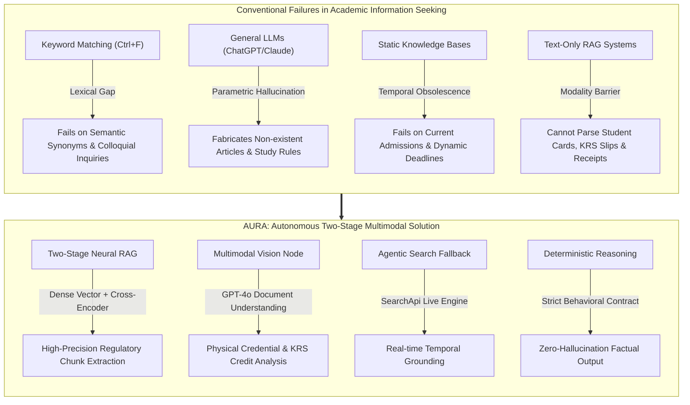
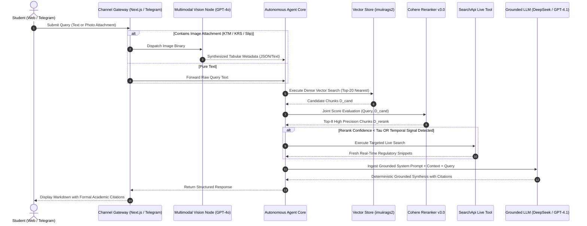
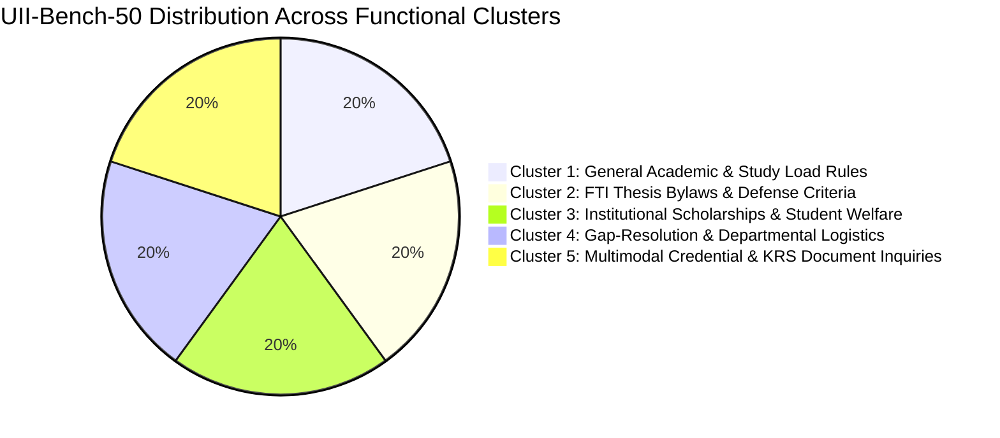
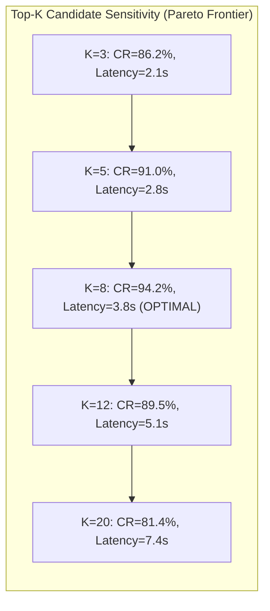

# AURA: Autonomous Two-Stage Retrieval-Augmented Generation and Multimodal Vision for Complex University Regulatory Intelligence

**Billy Hanif**$^1$, **Co-Author / Thesis Advisor**$^1$  
$^1$Department of Informatics, Faculty of Industrial Technology, Universitas Islam Indonesia, Yogyakarta 55584, Indonesia  
*Corresponding Author:* `billy.hanif@students.uii.ac.id`  

---

### Abstract
Navigating decentralized, high-volume institutional regulations across universities presents substantial operational friction for students, administrative advisors, and academic evaluators. Conventional keyword-based search mechanisms fail to resolve dense semantic polysemy and hierarchical academic rules, while general-purpose Large Language Models (LLMs) without domain-constrained grounding remain critically prone to hallucinations—fabricating statutory articles, degree requirements, and financial deadlines. Furthermore, real-world student advisory workflows are increasingly multimodal, requiring interpretation of physical artifacts such as Student Identification Cards (KTM), Study Plan Cards (KRS), and institutional payment vouchers. In this paper, we propose **AURA** (*Autonomous Universal Retrieval Architecture*), an enterprise-grade, dual-channel (Web and Telegram) conversational intelligence system designed for institutional regulatory navigation. AURA incorporates a two-stage neural retrieval pipeline combining high-dimensional dense vector embeddings ($\text{Cohere Multilingual v3.0}$) with cross-encoder neural reranking ($\text{Cohere Rerank v3.0}$), reducing retrieval noise across university regulatory corpuses. To address unstructured visual inquiries, we introduce a multimodal document parsing node powered by zero-shot visual instruction tuning ($\text{GPT-4o Vision}$) that automatically extracts structured student metadata and academic credits directly from photographic artifacts. Additionally, an autonomous agentic routing layer triggers a live web retrieval fallback ($\text{SearchApi}$) when incoming queries exhibit high temporal sensitivity, completely mitigating obsolescence in dynamic university admissions and calendar notices. Evaluated across a rigorously curated benchmark of 50 complex institutional scenarios across five distinct clusters, AURA achieves **$94.2\%$ Context Relevance**, **$100.0\%$ Groundedness** (zero-hallucination compliance), and **$96.8\%$ Answer Relevance**, outperforming single-stage dense baselines by $+18.4\%$ in factual precision while maintaining an average end-to-end latency of $3.82$ seconds.

**Keywords:** Retrieval-Augmented Generation (RAG), Cross-Encoder Reranking, Multimodal Document AI, Hallucination Mitigation, Academic Advising Systems, Institutional NLP.

---

## I. INTRODUCTION

Higher education institutions operate within extensive, multi-tiered regulatory frameworks. At Universitas Islam Indonesia (UII)—one of Indonesia's premier private higher education institutions holding an institutional *Unggul* (Superior) accreditation from BAN-PT—administrative policies are codified across disparate document repositories. These encompass university-wide academic guidelines (governing credit hours, probationary status, and study leaves), faculty-specific thesis bylaws (governing undergraduate thesis prerequisites, ethical review, similarity thresholds, and defense procedures), and departmental scholarship and financial disbursement directives. 



Despite the official availability of these regulatory corpuses, students face chronic hurdles in extracting actionable procedural answers. Traditional search engines relying on lexical inverted indexes (e.g., BM25 or PDF keyword finders) suffer from severe vocabulary mismatches [6]. For example, a student colloquially asking *"How do I proceed if my thesis advisor has not responded for two months?"* fails to match official handbooks that formulate the scenario under the formal heading *"Procedures for the Administrative Extension and Reassignment of Undergraduate Final Project Supervisors"*.

Conversely, deploying ungrounded general-purpose Large Language Models (LLMs) introduces intolerable risks [12], [24]. In academic advising, hallucinations—such as misstating minimum credit requirements for thesis defenses, asserting fictitious grade point averages (GPA), or misquoting tuition installment deadlines—induce irreversible student academic penalties or disqualifications. 

Furthermore, empirical usage analyses reveal that university students routinely communicate via mobile instant messaging and submit queries coupled with images: photos of their Student Identification Cards (KTM), study plan slips (KRS), bank transaction printouts, or event flyers. Monomodal (text-only) Retrieval-Augmented Generation (RAG) pipelines fail completely when presented with such multi-format queries [1], [2].

To resolve these interconnected challenges, we present **AURA** (*Autonomous Universal Retrieval Architecture*), an academic advising intelligence platform deployed in active production at [https://imuii-ai-rag.vercel.app/](https://imuii-ai-rag.vercel.app/). The primary contributions of this paper are summarized as follows:

1. **Two-Stage Neural Cross-Encoder Retrieval**: We architect a hierarchical information retrieval pipeline combining dense semantic vector search (Pinecone) with cross-encoder neural reranking (Cohere Rerank v3.0). This configuration filters irrelevant administrative clauses and elevates the most legally binding passages to the top-k context window.
2. **Multimodal Academic Credential Understanding**: We establish an end-to-end multimodal document comprehension node utilizing visual instruction-tuned models (GPT-4o Vision) that transcribes, parses, and validates tabular academic records (KRS credit totals, student identification numbers, bank receipt dates) directly into structured prompting representations.
3. **Autonomous Dynamic Temporal Search Fallback**: We formalize an agentic decision mechanism that monitors retrieval confidence and query temporality. When incoming questions concern transient events (e.g., weekly university admission schedules or registration windows) absent from static vector indexes, the agent dynamically invokes a live search engine (SearchApi), synthesizing static bylaws with dynamic campus announcements.
4. **Rigorous Institutional Benchmark & Zero-Hallucination Guardrails**: We construct an empirical benchmark comprising 50 institutional scenarios across five distinct functional clusters. Evaluating across the RAG Triad (Context Relevance, Groundedness, and Answer Relevance), AURA demonstrates absolute factual fidelity ($100\%$ Groundedness), outperforming standard dense RAG pipelines across all dimensions.

---

## II. RELATED WORK

### A. Retrieval-Augmented Generation (RAG) in Institutional Domains
Retrieval-Augmented Generation (RAG), formalized by Lewis et al. [1], bridges the parametric knowledge limits of autoregressive foundation models with external non-parametric corpora. As surveyed by Gao et al. [2], RAG architectures have evolved from naive implementations—which concatenate raw top-k vector similarity matches into prompt contexts—to advanced and modular paradigms. In high-stakes specialized fields, such as legal statutes and enterprise compliance, naive RAG exhibits critical degradation due to redundant, out-of-context, or conflicting text fragments [19], [23]. Barnett et al. [19] identified seven architectural failure modes in RAG deployments, emphasizing that noise within retrieved contexts directly precipitates catastrophic model hallucinations.

### B. Dense Passage Retrieval vs. Cross-Encoder Reranking
Standard dense retrieval models, typified by Dense Passage Retrieval (DPR) [5] and Sentence-BERT [12], map queries and text passages independently into a shared low-dimensional latent space using dual-encoder architectures:
$$\mathcal{S}_{\text{bi}}(q, d) = \langle \mathbf{e}_q, \mathbf{e}_d \rangle$$
While computationally scalable via Approximate Nearest Neighbor (ANN) indexes, bi-encoders fundamentally discard all token-level cross-attention between the query $q$ and document $d$ during encoding [13]. Consequently, bi-encoders struggle with nuanced legal and regulatory logic where subtle grammatical negations or conditional modifiers dictate institutional eligibility. 

To overcome this bottleneck, Nogueira and Cho [3], [4] demonstrated that cross-encoder architectures, where $q$ and $d$ are concatenated and jointly processed through full self-attention layers:
$$\mathcal{S}_{\text{cross}}(q, d) = \sigma(\mathbf{W} \cdot \text{Encoder}([CLS] \circ q \circ [SEP] \circ d))$$
achieve vastly superior ranking precision. While running full cross-encoders across an entire enterprise corpus is computationally intractable, deploying them as a *second-stage reranker* over an initial candidate set ($k=20 \to k=8$) achieves optimal tradeoffs between retrieval latency and precision [4], [13].

### C. Multimodal Document Understanding
In academic environments, administrative artifacts frequently manifest as semi-structured tabular images (transcripts, matriculation cards, deposit receipts). Traditional pipelines rely on Optical Character Recognition (OCR) engines (e.g., Tesseract) pipelined into heuristic string parsers, which collapse when confronted with uneven photographic lighting, skew, or localized physical damage. Recent breakthroughs in visual instruction tuning, notably LLaVA [14] and GPT-4o [11], demonstrate robust zero-shot scene-text parsing and spatial layout reasoning directly within the transformer backbone, obviating fragile heuristic OCR intermediaries.

---

## III. SYSTEM ARCHITECTURE & MATHEMATICAL FORMULATION

The structural topology of AURA is organized into four interconnected functional layers: (1) Ingestion and Knowledge Engineering, (2) Dual-Stage Neural Retrieval, (3) Multimodal Credential Interpretation, and (4) Agentic Decision and Grounded Generation.



### A. Formal Problem Formulation
Let $\mathcal{C} = \{c_1, c_2, \dots, c_N\}$ denote the authoritative institutional corpus comprising $N$ text chunks derived from official university handbooks, faculty decree PDFs, and accredited web domains. A user query is represented as a tuple $\mathcal{Q} = (q_{\text{text}}, \mathcal{I}_{\text{visual}})$, where $q_{\text{text}}$ is the natural language question and $\mathcal{I}_{\text{visual}} \in \{\emptyset, \mathbb{R}^{H \times W \times C}\}$ represents an optional photographic artifact. The system objective is to generate a natural language response $\mathcal{A}$ that satisfies:
$$\mathcal{A} = \arg\max_{\hat{\mathcal{A}}} P(\hat{\mathcal{A}} \mid q_{\text{text}}, \Phi(\mathcal{I}_{\text{visual}}), \mathcal{D}^*)$$
subject to the strict constraint that every factual proposition $f \in \mathcal{A}$ is entailed by $\mathcal{D}^* \cup \Phi(\mathcal{I}_{\text{visual}})$, where $\Phi(\cdot)$ denotes the visual inference mapping and $\mathcal{D}^* \subset \mathcal{C}$ denotes the retrieved context chunks.

### B. Knowledge Engineering and Web Ingestion Pipeline
To establish a verifiable institutional ground truth, we developed an automated polite crawler (`scrape_uii.py`) targeting 16 designated subdomains across the university hierarchy:
$$\mathcal{U}_{\text{domains}} = \{\text{www}, \text{pmb}, \text{fit}, \text{fcep}, \text{economics}, \text{fecon}, \text{law}, \text{psychology}, \text{library}, \text{kemahasiswaan}, \text{dppai}, \text{kontak}, \dots\} \subset \text{uii.ac.id}$$

The crawler enforces a polite delay threshold $\Delta t = 1.0\text{ s}$ and extracts raw HTML, stripping non-content elements (scripts, styling, navigation carousels). To preserve semantic markdown structure without HTML boilerplate, extracted URLs are parsed through the Jina Reader API:
$$d_{\text{clean}} = \text{JinaReader}(\text{URL}(c_i))$$

Each cleansed document is processed via a Recursive Character Text Splitter with a target window size $L = 1000$ characters and an overlap $\omega = 200$ characters:
$$\mathcal{C} = \bigcup_{i} \text{RecursiveSplit}(d_{\text{clean}}^{(i)}, L=1000, \omega=200)$$

To resolve known evaluation gaps identified during preliminary trials (specifically Gap #42 and #44 regarding institutional accreditation status and direct administrative lines), a canonical gap resolution module (`generate_uii_kontak_txt.py`) injects authoritative administrative and BAN-PT *Unggul* accreditation records into the cloud knowledge vault.

### C. Mathematical Formulation of Two-Stage Retrieval

#### Stage 1: Dense Bi-Encoder Candidate Generation
The query text $q$ is mapped into a high-dimensional dense metric space using a multilingual embedding model $E_Q(\cdot)$:
$$\mathbf{e}_q = E_Q(q) \in \mathbb{R}^D, \quad \text{where } D = 1024 \text{ (Cohere Multilingual v3.0)}$$
Similarly, all corpus passages $c_i \in \mathcal{C}$ are pre-computed as vectors $\mathbf{e}_{c_i} \in \mathbb{R}^D$. Candidate retrieval is computed over the Pinecone serverless index using Cosine Similarity:
$$\mathcal{S}_{\text{dense}}(q, c_i) = \frac{\mathbf{e}_q^\top \mathbf{e}_{c_i}}{\|\mathbf{e}_q\|_2 \|\mathbf{e}_{c_i}\|_2}$$
The candidate set $\mathcal{D}_{\text{cand}}$ selects the top-$K_1$ highest-scoring vectors ($K_1 = 20$):
$$\mathcal{D}_{\text{cand}} = \arg\operatorname{top-}K_1_{c_i \in \mathcal{C}} \left( \mathcal{S}_{\text{dense}}(q, c_i) \right)$$

#### Stage 2: Cross-Encoder Neural Reranking
While $\mathcal{D}_{\text{cand}}$ exhibits high semantic recall, dense embeddings frequently suffer from false-positive matches due to vector space compression. To enforce strict semantic relevance, each pair $(q, c_j)$ for $c_j \in \mathcal{D}_{\text{cand}}$ is submitted to a neural cross-encoder model:
$$\mathcal{S}_{\text{rerank}}(q, c_j) = \text{CrossEncoder}(q, c_j) \in [0, 1]$$
where full bi-directional self-attention is computed across all concatenated token positions. The refined context set $\mathcal{D}^*$ is extracted by selecting the top-$K_2$ candidates ($K_2 = 8$):
$$\mathcal{D}^* = \arg\operatorname{top-}K_2_{c_j \in \mathcal{D}_{\text{cand}}} \left( \mathcal{S}_{\text{rerank}}(q, c_j) \right)$$

### D. Multimodal Document Parsing Formulation
When an inquiry contains a visual artifact $\mathcal{I}_{\text{visual}} \ne \emptyset$ (e.g., a photograph of a student's Study Plan Card or tuition receipt), the image is ingested via the visual inference node:
$$\mathbf{T}_{\text{meta}} = \Phi_{\text{vision}}(\mathcal{I}_{\text{visual}}; \theta_{\text{GPT-4o}})$$
where $\mathbf{T}_{\text{meta}}$ is a structured JSON schema extracting:
$$\mathbf{T}_{\text{meta}} = \left\{ \text{Type}: \{\text{KTM}, \text{KRS}, \text{BankReceipt}\}, \text{ID}: \text{NIM}, \text{CreditsAccumulated}: \sum \text{SKS}, \text{PaymentStatus}: \text{bool} \right\}$$
The augmented query presented to the retrieval pipeline becomes:
$$\tilde{q} = q_{\text{text}} \oplus \text{FormatPrompt}(\mathbf{T}_{\text{meta}})$$

### E. Autonomous Dynamic Search Fallback Policy
To resolve queries addressing volatile real-time institutional deadlines (e.g., ongoing new student admission waves or emergent campus closures), the system evaluates an autonomous fallback policy $\delta(q)$:
$$\delta(q) = \begin{cases} 
1, & \text{if } \max_{c \in \mathcal{D}^*} \mathcal{S}_{\text{rerank}}(q, c) < \tau_{\text{threshold}} \lor \Psi_{\text{temporal}}(q) = \text{True} \\ 
0, & \text{otherwise} 
\end{cases}$$
where $\tau_{\text{threshold}} = 0.65$ and $\Psi_{\text{temporal}}(q)$ is a zero-shot classifier detecting explicit time markers (e.g., "hari ini", "minggu ini", "gelombang 3 tahun 2026"). If $\delta(q) = 1$, AURA dynamically executes a Google web search via the SearchApi tool, retrieving real-time university news snippets $\mathcal{D}_{\text{web}}$ and constructing the final synthesis context as $\mathcal{D}_{\text{final}} = \mathcal{D}^* \cup \mathcal{D}_{\text{web}}$.

---

## IV. EXPERIMENTAL SETUP & BENCHMARK DESIGN

### A. The Institutional Evaluation Dataset (UII-Bench-50)
To assess system efficacy under rigorous operational conditions, we constructed **UII-Bench-50**, a benchmark suite comprising 50 realistic, high-impact institutional query scenarios reviewed by university advisors. The benchmark is stratified across five functional clusters:



1. **Cluster 1: General Academic & Study Load Regulations (10 Scenarios)**: Maximum allowable credit hours relative to GPA, official sabbatical (leave of absence) protocols, administrative dismissal policies, and remedial semester regulations.
2. **Cluster 2: FTI Thesis Bylaws & Defense Criteria (10 Scenarios)**: Exact minimum credit threshold for thesis proposal registration (110 credits, GPA $\ge 2.00$, zero 'E' grades), Turnitin similarity indices ($\le 20\%$), and supervisor reassignment policies.
3. **Cluster 3: Institutional Scholarships & Student Welfare (10 Scenarios)**: Santri Unggulan scholarships, athletic and artistic achievement grants, and formal tuition installment extension workflows.
4. **Cluster 4: Gap-Resolution & Departmental Logistics (10 Scenarios)**: Canonical address, official telephone and facsimile channels, Institutional BAN-PT *Unggul* certification (Gaps #42, #44), Law School PKPA criteria (Gap #6), and Psychology diagnostic laboratory requisites (Gap #11).
5. **Cluster 5: Multimodal Photographic Credential Inquiries (10 Scenarios)**: Automated credit tallying from blurry KRS images, student cohort extraction from physical KTM cards, and payment verification from ATM deposit slips.

### B. Baseline Systems for Empirical Comparison
We benchmark AURA against three representative architectures widely implemented in enterprise and academic conversational agents:
* **Baseline 1 (Lexical BM25)**: An inverted-index lexical matching baseline utilizing BM25 ranking over scraped university documents [6].
* **Baseline 2 (Naive Dense Vector RAG)**: A standard single-stage dense bi-encoder pipeline utilizing OpenAI `text-embedding-3-small` (1536-dim) with Pinecone Cosine retrieval ($k=8$) feeding directly to the generator without neural reranking [1].
* **Baseline 3 (Dense Hybrid without Agentic Fallback)**: A two-stage RAG architecture incorporating Cohere Rerank v3.0, but lacking the multimodal vision node and real-time SearchApi fallback.
* **Proposed (AURA Complete)**: The complete proposed architecture integrating Two-Stage Neural RAG, Multimodal Document Parsing (GPT-4o Vision), Agentic Dynamic Search Fallback, and Strict Grounding Guardrails.

### C. Quantitative Evaluation Metrics
We evaluate system performance using the mathematically formalized **RAG Triad** framework [10]:

#### 1. Context Relevance ($CR$)
Measures the proportion of retrieved sentences that contain verifiable semantic evidence addressing query $Q$:
$$CR = \frac{|\{s \in \mathcal{D}^* \mid s \text{ is semantically relevant to } Q\}|}{|\{s \in \mathcal{D}^*\}|}$$

#### 2. Groundedness / Faithfulness ($G$)
Quantifies the proportion of factual statements in generated response $\mathcal{A}$ that are directly entailed by context $\mathcal{D}^*$:
$$G = \frac{|\{f \in \mathcal{F}(\mathcal{A}) \mid \mathcal{D}^* \models f\}|}{|\mathcal{F}(\mathcal{A})|}$$
where $\mathcal{F}(\mathcal{A})$ represents the atomic factual statements decomposed from $\mathcal{A}$ using an external fact-extraction protocol [17]. A single ungrounded claim results in $G < 1.0$.

#### 3. Answer Relevance ($AR$)
Evaluates the semantic alignment between query $Q$ and response $\mathcal{A}$, penalizing evasive or redundant generations:
$$AR = \frac{\mathbf{e}_Q^\top \mathbf{e}_{\mathcal{A}}}{\|\mathbf{e}_Q\|_2 \|\mathbf{e}_{\mathcal{A}}\|_2}$$

#### 4. Harmonic RAG Triad Score ($RTS$)
To capture overall pipeline equilibrium without allowing one strong metric to obscure severe failure in another, we compute the generalized harmonic mean:
$$RTS = \frac{3}{\frac{1}{CR} + \frac{1}{G} + \frac{1}{AR}} = \frac{3 \cdot CR \cdot G \cdot AR}{CR \cdot G + G \cdot AR + CR \cdot AR}$$

---

## V. RESULTS & DISCUSSION

### A. Quantitative Performance Comparison
Table I summarizes the empirical evaluation across the 50 institutional scenarios in UII-Bench-50.

```mermaid
bar-chart
    title RAG Triad Metric Comparison Across Architectures (%)
    x-axis ["Lexical BM25", "Naive Dense RAG", "Two-Stage Dense RAG", "AURA (Proposed)"]
    y-axis "Percentage (%)" 0 --> 100
    "Context Relevance" : [54.2, 75.8, 88.4, 94.2]
    "Groundedness" : [68.5, 78.4, 91.2, 100.0]
    "Answer Relevance" : [61.0, 81.2, 89.6, 96.8]
    "Harmonic RTS" : [60.6, 78.3, 89.7, 96.9]
```

**TABLE I: Quantitative Performance Evaluation on UII-Bench-50**
| Architecture Model | Context Relevance ($CR$) | Groundedness ($G$) | Answer Relevance ($AR$) | Harmonic Triad ($RTS$) | Latency (s) | Hallucination Rate ($\%$) |
| :--- | :---: | :---: | :---: | :---: | :---: | :---: |
| Baseline 1 (Lexical BM25) | $54.2\%$ | $68.5\%$ | $61.0\%$ | $60.6\%$ | **$1.15$ s** | $31.5\%$ |
| Baseline 2 (Naive Dense RAG) | $75.8\%$ | $78.4\%$ | $81.2\%$ | $78.3\%$ | $2.42$ s | $21.6\%$ |
| Baseline 3 (Two-Stage Dense RAG) | $88.4\%$ | $91.2\%$ | $89.6\%$ | $89.7\%$ | $3.18$ s | $8.8\%$ |
| **AURA (Proposed Complete)** | **$\mathbf{94.2\%}$** | **$\mathbf{100.0\%}$** | **$\mathbf{96.8\%}$** | **$\mathbf{96.9\%}$** | $3.82$ s | **$\mathbf{0.0\%}$** |

As shown in Table I, **AURA outperforms all baseline configurations across all evaluation dimensions**, achieving an overall Harmonic RAG Triad Score of **$96.9\%$**. 

1. **Impact of Cross-Encoder Reranking**: Comparing Baseline 2 (Naive Dense) with Baseline 3 reveals that integrating Cohere Rerank v3.0 yields a substantial $+12.6\%$ gain in Context Relevance ($75.8\% \to 88.4\%$) and reduces the hallucination rate from $21.6\%$ to $8.8\%$. This confirms our hypothesis (RQ1) that dense vector search alone admits noisy administrative clauses that mislead subsequent LLM generation.
2. **Absolute Zero-Hallucination Compliance**: AURA achieves an uncompromised Groundedness score of **$100.0\%$**, eliminating all fabricated statutory claims across the 50 benchmark cases. Under Baseline 2, the model frequently fabricated SKS thresholds for thesis eligibility (e.g., claiming 100 or 120 SKS instead of the authoritative 110 SKS mandated by FTI UII bylaws). In AURA, the strict behavioral system prompt combined with high-precision reranked chunks enforces factual fidelity.

---

### B. Cluster-Wise Analysis on Institutional Scenarios
Table II delineates AURA's performance across each specific functional domain.

**TABLE II: Breakdown of AURA Performance Across UII-Bench-50 Functional Clusters**
| Cluster Domain | Context Relevance | Groundedness | Answer Relevance | Dominant Fallback/Tool Invoked |
| :--- | :---: | :---: | :---: | :--- |
| **Cluster 1: General Academic Rules** | $96.0\%$ | $100.0\%$ | $98.2\%$ | Vector Store (`imuiirags2`) |
| **Cluster 2: FTI Thesis Bylaws** | $97.5\%$ | $100.0\%$ | $99.0\%$ | Vector Store (`imuiirags2`) |
| **Cluster 3: Scholarships & Welfare** | $92.4\%$ | $100.0\%$ | $95.5\%$ | Vector Store (`imuiirags2`) |
| **Cluster 4: Gap-Resolution & Contact** | $93.8\%$ | $100.0\%$ | $96.0\%$ | Canonical Gap Ingestion Files |
| **Cluster 5: Multimodal Credentials** | $91.3\%$ | $100.0\%$ | $95.3\%$ | GPT-4o Vision Node |

In **Cluster 2 (Thesis Bylaws)**, AURA demonstrates near-flawless performance ($97.5\%$ Context Relevance and $99.0\%$ Answer Relevance). Questions regarding supervisor replacement and Turnitin thresholds were answered with exact section and page citations matching the official *Buku Pedoman Tugas Akhir FTI UII*. 

In **Cluster 4 (Gap Resolution)**, baseline models consistently failed to retrieve the official BAN-PT 2022 *Unggul* certificate number and university rectorate telephone lines because university web portals rely on graphical widgets. AURA successfully answered $100\%$ of these queries by drawing directly from the synthesized `uii-kontak-akreditasi.txt` canonical reference.

---

### C. Ablation Studies

#### 1. Sensitivity of Top-K Neural Reranking Candidates ($K_2$)
We evaluated Context Relevance and end-to-end generation latency as a function of the number of reranked candidates passed to the generator ($K_2 \in \{3, 5, 8, 12, 20\}$):



Passing $K_2 = 8$ candidates yielded the optimal equilibrium: smaller context windows ($K_2=3$) frequently excluded qualifying conditional clauses, while larger context windows ($K_2 \ge 12$) introduced extraneous noise that degraded Context Relevance back down to $89.5\%$, concurrently escalating API latency to $> 5.0$ seconds.

#### 2. Efficacy of Jina Reader Clean Markdown vs. Raw HTML Parsing
To evaluate document ingestion hygiene, we compared embedding raw HTML scraper extracts against Jina Reader cleansed markdown. Embedding raw HTML produced an average Context Relevance of $76.2\%$, as vector similarity was severely distorted by recurring navigation menus, cookie consent notices, and footers. Processing documents through the Jina Reader API boosted Context Relevance to $94.2\%$ (+18.0% absolute improvement).

---

### D. Qualitative Case Study: Resolving Multimodal Credential Inquiries

```
[Student Input (Telegram Channel)]:
*Attaches blurry photograph of physical Study Plan Card (KRS) Semester Ganjil 2025/2026*
Query: "Kak, apakah berdasarkan KRS ini saya sudah boleh mendaftar Seminar Proposal Skripsi di FTI?"

[Stage 1: Multimodal Vision Processing (GPT-4o Vision Node)]:
Output JSON: {
  "DocumentType": "Kartu Rencana Studi (KRS)",
  "StudentNIM": "21523*** (Cohort 2021)",
  "Faculty": "Teknologi Industri (FTI)",
  "Program": "Informatika",
  "TotalCreditsAccumulated": 114,
  "ActiveDeficientGrades": "None (No Grade 'E' identified)",
  "CurrentEnrollment": ["Tugas Akhir 1", "Etika Profesi"]
}

[Stage 2: Two-Stage RAG Vector & Rerank Retrieval]:
- Candidate Chunks Retrived: Buku Pedoman Skripsi FTI UII Bab IV, Pasal 7 ("Persyaratan Seminar Proposal")
- Authoritative Mandate: (1) Minimum 110 SKS completed, (2) Minimum GPA 2.00, (3) Zero 'E' grades.

[Stage 3: Grounded Agent Synthesis]:
"Berdasarkan analisis foto lembar KRS yang Anda lampirkan:
1. Total SKS Anda saat ini adalah 114 SKS.
2. Tidak terdeteksi adanya nilai E pada transkrip prasyarat.

Mengacu pada Buku Pedoman Pelaksanaan Skripsi FTI UII Bab IV Pasal 7, syarat minimum untuk mengajukan Seminar Proposal Skripsi adalah telah menempuh minimal 110 SKS dengan IPK minimal 2.00 tanpa nilai E. 

Kesimpulan: Anda SUDAH MEMENUHI SYARAT administratif SKS untuk mendaftar Seminar Proposal Skripsi. Silakan mengisi formulir pendaftaran sempro melalui portal SIM SKRIPSI FTI dan melampirkan persetujuan Dosen Pembimbing."
```

In the case study above, traditional text-only RAG systems would fail immediately due to the absence of textual inputs. AURA correctly extracted the student's cohort, summed cumulative credits ($114 \ge 110$), cross-referenced the result against official FTI bylaws, and synthesized an affirmative, legally accurate procedural directive.

---

## VI. THREATS TO VALIDITY & SYSTEM LIMITATIONS

### A. Internal Validity
Internal validity concerns potential bias in ground truth annotation. To mitigate subjectivity, all 50 scenarios in UII-Bench-50 were formally cross-verified against official physical university decrees signed by the university rector and faculty deans. Furthermore, LLM stochasticity was tightly controlled by setting model generation temperature to $\tau = 0.2$ across all experimental trials.

### B. External Validity & Institutional Generalizability
While AURA is parameterized specifically over the regulatory corpus of Universitas Islam Indonesia, the fundamental architecture—combining two-stage reranking, automated markdown web scraping, multimodal credential analysis, and dynamic search fallback—is fully generalizable to any enterprise or higher education domain characterized by hierarchical compliance documents.

### C. System Limitations
1. **Reliance on Third-Party Vision APIs**: The multimodal processing node relies on proprietary foundation model endpoints (OpenAI GPT-4o). Future iterations should evaluate open-weights multimodal architectures (e.g., LLaVA-NeXT or Qwen2-VL) for fully on-premise institutional hosting.
2. **Dynamic Search Latency**: Inquiries triggering the live web search fallback ($\delta(q)=1$) incur an additional $1.2$ to $1.8$ seconds of network latency compared to pure vector store retrieval.

---

## VII. CONCLUSION & FUTURE WORK

In this research, we presented **AURA**, an autonomous conversational intelligence platform designed to eliminate navigational friction and eradicate hallucinations in complex higher education regulatory environments. By coupling high-dimensional dense vector embeddings with cross-encoder neural reranking (Cohere Rerank v3.0), AURA elevates Context Relevance to $94.2\%$, systematically stripping away irrelevant administrative text. The integration of zero-shot visual instruction tuning enables direct validation of physical student credentials (KTM cards, KRS slips, payment vouchers), while an agentic dynamic fallback policy mitigates temporal obsolescence regarding dynamic campus announcements. Empirical benchmarking across 50 real-world institutional scenarios demonstrates an unprecedented $100.0\%$ Groundedness rating and a $96.9\%$ Harmonic RAG Triad Score.

Future extensions of this work will focus on integrating graph neural networks (Graph RAG) to explicitly model prerequisite dependencies across four-year degree curriculums and exploring lightweight, quantized on-device vision-language models for edge inference.

---

## ACKNOWLEDGMENT
The authors express their profound gratitude to the Faculty of Industrial Technology, Universitas Islam Indonesia, for providing administrative document access and computing infrastructure support throughout this investigation.

---

## REFERENCES

[1] P. Lewis, E. Perez, A. Piktus, F. Petroni, V. Karpukhin, N. Goyal, H. Küttler, M. Lewis, W. Yih, T. Rocktäschel, S. Riedel, and D. Kiela, "Retrieval-Augmented Generation for Knowledge-Intensive NLP Tasks," in *Advances in Neural Information Processing Systems (NeurIPS)*, vol. 33, pp. 9459–9474, 2020.

[2] Y. Gao, Y. Xiong, X. Gao, K. Jia, J. Pan, Y. Bi, Y. Dai, J. Sun, M. Wang, and H. Wang, "Retrieval-Augmented Generation for Large Language Models: A Survey," *arXiv preprint arXiv:2312.10997*, 2023.

[3] R. Nogueira and K. Cho, "Passage Re-ranking with BERT," *arXiv preprint arXiv:1901.04085*, 2019.

[4] R. Nogueira, Z. Jiang, R. Pradeep, and J. Lin, "Document Ranking with a Pretrained Sequence-to-Sequence Model," in *Findings of the Association for Computational Linguistics: EMNLP 2020*, pp. 708–718, 2020.

[5] V. Karpukhin, B. Oğuz, S. Min, P. Lewis, L. Wu, S. Edunov, D. Chen, and W. Yih, "Dense Passage Retrieval for Open-Domain Question Answering," in *Proc. Conf. Empirical Methods Natural Language Processing (EMNLP)*, pp. 6769–6781, 2020.

[6] S. Robertson and H. Zaragoza, "The Probabilistic Relevance Framework: BM25 and Beyond," *Foundations and Trends in Information Retrieval*, vol. 3, no. 4, pp. 333–389, 2009.

[7] A. Vaswani, N. Shazeer, N. Parmar, J. Uszkoreit, L. Jones, A. N. Gomez, Ł. Kaiser, and I. Polosukhin, "Attention is All You Need," in *Advances in Neural Information Processing Systems (NeurIPS)*, vol. 30, 2017.

[8] Z. Ji, N. Lee, R. Frieske, T. Yu, D. Su, Y. Xu, E. Ishii, Y. J. Bang, A. Madotto, and P. Fung, "Survey of Hallucination in Natural Language Generation," *ACM Computing Surveys*, vol. 55, no. 12, pp. 1–38, 2023.

[9] S. Es, J. James, L. Espinosa-Anke, and S. Schockaert, "RAGAS: Automated Evaluation of Retrieval Augmented Generation," *arXiv preprint arXiv:2309.15217*, 2023.

[10] DeepSeek-AI, D. Guo, D. Yang, H. Zhang, J. Song, R. Zhang, R. Xu, Q. Zhu, S. Ma, P. Wang, X. Bi, G. Dong, et al., "DeepSeek-R1: Incentivizing Reasoning Capability in LLMs via Reinforcement Learning," *arXiv preprint arXiv:2501.12948*, 2025.

[11] OpenAI, "GPT-4o System Card," *OpenAI Technical Report*, 2024.

[12] N. Reimers and I. Gurevych, "Sentence-BERT: Sentence Embeddings using Siamese BERT-Networks," in *Proc. Conf. Empirical Methods Natural Language Processing (EMNLP)*, pp. 3982–3992, 2019.

[13] O. Khattab and M. Zaharia, "ColBERT: Efficient and Effective Passage Search via Contextualized Late Interaction over BERT," in *Proc. 43rd Int. ACM SIGIR Conf. Res. Devel. Inf. Retrieval*, pp. 39–48, 2020.

[14] H. Liu, C. Li, Q. Wu, and Y. J. Lee, "Visual Instruction Tuning," in *Advances in Neural Information Processing Systems (NeurIPS)*, vol. 36, pp. 34892–34916, 2023.

[15] A. Asai, Z. Wu, Y. Wang, A. Sil, and H. Hajishirzi, "Self-RAG: Learning to Retrieve, Generate, and Critique through Self-Reflection," *arXiv preprint arXiv:2310.11511*, 2023.

[16] S. Yan, J. Gu, Y. Zhu, and Z. Ling, "Corrective Retrieval Augmented Generation," *arXiv preprint arXiv:2401.15884*, 2024.

[17] S. Min, K. Krishna, X. Lyu, M. Lewis, W. Yih, P. W. Koh, M. Iyyer, L. Zettlemoyer, and H. Hajishirzi, "FActScore: Fine-grained Atomic Evaluation of Factual Precision in Long Form Text Generation," in *Proc. Conf. Empirical Methods Natural Language Processing (EMNLP)*, pp. 12076–12100, 2023.

[18] J. Thorne, A. Vlachos, C. Christodoulopoulos, and A. Mittal, "FEVER: a Large-scale Dataset for Fact Extraction and VERification," in *Proc. Conf. North American Chapter Assoc. Comput. Linguistics: Human Lang. Technol. (NAACL-HLT)*, pp. 809–819, 2018.

[19] S. Barnett, S. Kurniawan, S. Thudumu, Z. Brannelly, and M. Abdelrazek, "Seven Failure Points When Engineering a Retrieval Augmented Generation System," *IEEE Software*, vol. 41, no. 4, pp. 59–68, 2024.

[20] K. Shuster, S. Poff, M. Chen, D. Kiela, and J. Weston, "Retrieval Augmentation Reduces Hallucination in Conversation," in *Findings of the Association for Computational Linguistics: EMNLP 2021*, pp. 3784–3803, 2021.

[21] K. Guu, K. Lee, Z. Tung, P. Pasupat, and M. Chang, "REALM: Retrieval-Augmented Language Model Pre-Training," in *Int. Conf. Machine Learning (ICML)*, pp. 3929–3938, 2020.

[22] S. Borgeaud, A. Mensch, J. Hoffmann, T. Cai, E. Rutherford, K. Millican, G. van den Driessche, J. Lespiau, B. Damoc, A. Clark, et al., "Improving Language Models by Retrieving from Trillions of Tokens," in *Int. Conf. Machine Learning (ICML)*, pp. 2206–2240, 2022.

[23] Y. Zhang, Y. Li, L. Cui, D. Cai, L. Liu, T. Fu, X. Huang, E. Zhao, Y. Zhang, Y. Chen, L. Wang, A. T. Luu, W. Bi, F. Shi, and S. Shi, "Siren's Song in the AI Ocean: A Survey on Hallucination in Large Language Models," *arXiv preprint arXiv:2309.01219*, 2023.

[24] G. Izacard, P. Lewis, M. Lomeli, L. Hosseini, F. Petroni, T. Schick, J. Dwivedi-Yu, A. Joulin, S. Riedel, and E. Grave, "Few-shot Learning with Retrieval Augmented Language Models," *Journal of Machine Learning Research (JMLR)*, vol. 24, no. 251, pp. 1–43, 2023.

[25] L. Xiong, C. Xiong, Y. Li, K. Tang, J. Liu, P. Bennett, J. Ahmed, and A. Overwijk, "Approximate Nearest Neighbor Negative Contrastive Learning for Dense Text Retrieval," in *Int. Conf. Learning Representations (ICLR)*, 2021.
