# PRODUCT REQUIREMENTS DOCUMENT (PRD)
## AURA UII — Autonomous Academic Retrieval-Augmented Generation Platform

* **Document Version:** 2.0.0 (Release Candidate / Production MVP)
* **Author / Researcher:** Billy Hanif (Teknik Informatika — FTI Universitas Islam Indonesia)
* **Target Audience:** AI Engineering Agents, Thesis Advisors, System Evaluators, Core Contributors
* **Last Updated:** September 2026
* **Live Deployment:** [https://imuii-ai-rag.vercel.app/](https://imuii-ai-rag.vercel.app/)
* **Repository:** [https://github.com/848ill/IMUII-AI-RAG](https://github.com/848ill/IMUII-AI-RAG)

---

## 1. Executive Summary & Problem Statement

### 1.1 Background & Problem
Civitas akademika Universitas Islam Indonesia (UII)—terutama mahasiswa sarjana dan magister—kerap menghadapi kesulitan dalam menavigasi ribuan halaman dokumen regulasi resmi yang tersebar, seperti:
1. **Buku Pedoman Akademik Universitas**: Regulasi beban SKS, cuti kuliah, konversi nilai, dan semester antara.
2. **Pedoman Penulisan Tugas Akhir & Skripsi FTI**: Syarat pengajuan proposal, seminar hasil, kode etik penelitian, dan yudisium.
3. **Panduan Beasiswa & Kemahasiswaan**: Syarat beasiswa unggulan, beasiswa alumni, dan dispensasi keterlambatan KRS.

Sistem pencarian konvensional (PDF search berbasis kata kunci *Ctrl+F*) sering gagal memahami sinonim konteks akademik (contoh: "bimbingan macet" vs "dispensasi perpanjangan masa studi"), sementara chatbot berbasis Large Language Model (LLM) umum rentan mengalami **halusinasi** dan mengarang pasal/aturan kampus yang menyesatkan.

### 1.2 Proposed Solution
**AURA UII** adalah platform asisten virtual akademik cerdas berbasis **Two-Stage Retrieval-Augmented Generation (RAG)** yang mengintegrasikan penalaran kognitif tingkat lanjut (**DeepSeek Reasoner / R1**) dengan verifikasi dokumen resmi secara *grounded* (tanpa halusinasi). Dilengkapi dengan antarmuka pengguna berspesifikasi *Awwwards/Agency-grade* bebas *AI-slop*, Three.js WebGL 60 FPS, dan sistem otentikasi hybrid (Google OAuth, Admin Kredensial, serta 1-Klik Mode Demo Sidang).

---

## 2. User Personas & Core Use Cases

| Persona | Deskripsi | Kebutuhan Utama |
| :--- | :--- | :--- |
| **Mahasiswa UII** | Mahasiswa aktif FTI / fakultas lain yang membutuhkan klarifikasi cepat regulasi. | Mendapatkan jawaban pasti seputar syarat skripsi, KRS, atau beasiswa dengan sitasi dokumen asli. |
| **Dosen Pembimbing & Penguji** | Dosen evaluator yang memverifikasi keakuratan teknis dan implementasi skripsi. | Menguji ketepatan penarikan regulasi, memantau *latency*, dan menguji fungsionalitas sistem. |
| **Administrator Akademik** | Pengelola sistem pengetahuan (*knowledge manager*). | Mengunggah PDF regulasi baru, mengindeks vektor ke Pinecone, dan memantau riwayat sesi. |

---

## 3. End-to-End System Architecture

Arsitektur AURA UII memisahkan antarmuka klien Next.js 14, lapisan otentikasi & database Supabase, dan orkestrasi pipeline RAG 6-tahap di n8n:

```mermaid
graph TD
    User["👤 Mahasiswa / Dosen (Browser)"] -->|HTTPS / Next.js 14| Frontend["💻 AURA UII Frontend (Vercel)"]
    
    subgraph Frontend_App["Frontend Layer (Next.js 14 App Router)"]
        Landing["Landing Page (Three.js WebGL 60FPS)"]
        AuthModal["Auth: Google OAuth / Admin / Demo"]
        ChatDesk["Workspace Chat & Command Input Deck"]
        DocPanel["Knowledge Repository (PDF Drag & Drop)"]
    end

    Frontend -->|OAuth Handshake| GCP["🔑 Google Cloud Platform (OAuth 2.0)"]
    Frontend -->|Client State & Realtime| Supabase["⚡ Supabase (Singapore ap-southeast-1)"]

    subgraph Supabase_Backend["Backend & Storage (Supabase Postgres)"]
        AuthSvc["Supabase Auth"]
        DB["5 PostgreSQL Tables (RLS Enabled)"]
        Bucket["2 Storage Buckets (chat-files, documents)"]
    end

    Frontend -->|POST /api/n8n/trigger| N8N["⚙️ n8n RAG Orchestration Workflow"]

    subgraph RAG_Pipeline["Two-Stage Neural RAG Pipeline"]
        Ingest["01. PDF Parser & Recursive Splitter (1000/200)"]
        Embed["02. Cohere Multilingual v3.0 (1024-dim)"]
        Pinecone["03. Pinecone Vector Search (Top-20 Nearest)"]
        Rerank["04. Cohere Rerank v3.0 (Top-8 High Precision)"]
        LLM["05. DeepSeek Reasoner (CoT Grounded Reasoning)"]
    end

    N8N --> Ingest --> Embed --> Pinecone --> Rerank --> LLM
    LLM -->|Streamed Response & Metadata| N8N
    N8N -->|JSON Response| Frontend
    Frontend -->|Store Assistant Message| DB
```



---

## 4. Functional Requirements (FR)

### FR-1: Visual Design & Agency-Grade Workspace (No AI Slop)
* **FR-1.1**: Palet visual wajib mengadopsi estetika *luxury technical brutalism* terinspirasi dari `landonorris.com`, `izadesign.site`, dan `0xalvary.xyz`:
  * *Deep Void Canvas*: `#070709` dan `#0D0E14`.
  * *Borders*: `border-white/[0.08]` hingga `border-white/[0.12]`.
  * *Accents*: Neon Emerald (`#00F5A0`) & Cyan (`#00D2FF`).
  * *Typography*: **Plus Jakarta Sans** (sans-serif) dipadukan dengan label telemetri teknikal **Monospace** (`font-mono text-[10px] tracking-widest uppercase`).
* **FR-1.2 Three.js WebGL Background**:
  * Merender *particle constellation* dan *central wireframe core*.
  * Wajib di-cap pada **60 FPS** untuk mencegah pemborosan GPU pada layar ProMotion (120Hz/144Hz).
  * Menggunakan *smart pixel ratio* maksimal `1.5x` di layar Retina.
  * Wajib memiliki *Tab Visibility API Listener* yang mem-pause rendering saat pengguna berpindah tab (penggunaan GPU langsung 0%).
* **FR-1.3 Immersive Full-Viewport**:
  * Ruang kerja chat saat pengguna login harus berukuran satu layar penuh (`h-screen overflow-hidden flex`) tanpa double-navbar.

### FR-2: Hybrid Authentication Engine
* **FR-2.1 Google OAuth**: Terhubung langsung dengan Google Cloud Platform Client ID dan Supabase Auth, dengan auto-redirect ke `https://imuii-ai-rag.vercel.app/auth/callback`.
* **FR-2.2 Client-Side Session Hydration**: Token OAuth wajib disimpan langsung ke `localStorage` browser pada saat *callback redirect* agar sesi tidak hilang saat browser di-refresh.
* **FR-2.3 Kredensial Khusus Admin**:
  * Mendukung input identifier langsung tanpa format email:
    * ID: `hambaAllah` (secara internal dipetakan ke `hambaallah@uii.ac.id`)
    * Password: `Takbir`
* **FR-2.4 1-Click Mode Demo Sidang**:
  * Tombol darurat di beranda dan halaman login yang langsung mengaktifkan sesi simulasi lokal *scholar* jika terjadi kendala jaringan kampus saat presentasi di hadapan penguji.

### FR-3: Multi-Session Chat & Realtime Sync
* **FR-3.1 Manajemen Sesi**: Pengguna dapat membuat percakapan baru (`⌘N`), mengubah nama percakapan (*inline rename*), menghapus percakapan dengan modal konfirmasi brutalist, serta melakukan pencarian riwayat obrolan secara live (*live search*).
* **FR-3.2 Message Interaction**:
  * Pengguna dapat mengedit pesan yang telah dikirim (*re-submit*).
  * Pengguna dapat menyalin pesan dalam format markdown dengan tombol salin instan.
  * Tombol *Regenerate Response* untuk meminta jawaban baru.
  * Feedback jempol (*thumbs up / down*) untuk evaluasi akurasi jawaban.
  * Tombol *Export Transcript* untuk mengunduh riwayat obrolan dalam format `.txt`.

### FR-4: Document Ingestion & Storage
* **FR-4.1 File Attachment Chat**: Mendukung lampiran dokumen (`.pdf`, `.docx`, `.txt`, `.csv`) dan gambar (`.png`, `.jpg`) langsung di dalam gelembung obrolan yang tersimpan di bucket `chat-files`.
* **FR-4.2 Knowledge Base Repository**:
  * Panel khusus pengunggahan dokumen PDF panduan kampus dengan mekanisme *Drag & Drop*.
  * Progress bar unggah real-time berbasis gradient neon emerald-to-cyan.
  * Status badge vektor: `TERINDEKS PINECONE`, `PROSES EMBEDDING`, `MENUNGGU VEKTOR`, `GAGAL INDEKS`.
  * Penyimpanan file PDF di bucket `documents` Supabase.

### FR-5: Two-Stage RAG Pipeline Specification
* **Stage 1 (Text Extraction & Chunking)**:
  * Chunk Size: 1000 karakter.
  * Chunk Overlap: 200 karakter.
  * Separators: `["\n\n", "\n", " ", ""]`.
* **Stage 2 (Vector Embeddings)**:
  * Model: `cohere.embed-multilingual-v3.0`.
  * Output Dimension: 1024-dim dense vectors.
* **Stage 3 (High-Dimensional Vector Search)**:
  * Database: Pinecone Index Serverless.
  * Metric: Cosine Similarity.
  * Retrieval Top-K: Mengambil **20 kandidat chunk teratas**.
* **Stage 4 (Cross-Encoder Reranking)**:
  * Model: `cohere.rerank-v3.0`.
  * Rerank Output: Menyaring 20 kandidat menjadi **8 chunk dokumen paling presisi**.
* **Stage 5 (Chain-of-Thought Reasoning)**:
  * Model: `deepseek-reasoner` (DeepSeek R1).
  * Temperature: `0.2` (Determinisme tinggi untuk dokumen akademik).
  * System Grounding: Menolak menjawab jika informasi tidak ditemukan dalam dokumen resmi yang terambil.

---

## 5. Non-Functional Requirements (NFR)

### NFR-1: Performance & Latency SLAs
* **First Contentful Paint (FCP)**: $< 1.2$ detik pada koneksi 4G standar.
* **Time to Interactive (TTI)**: $< 2.0$ detik.
* **Client JavaScript Bundle**: $< 70$ kB pada rute utama (dicapai melalui `optimizePackageImports` dan single variable font).
* **WebGL Frame Rate**: Stabil 60 FPS pada GPU terintegrasi (Intel Iris / Apple M-series).
* **RAG Response Latency**:
  * Vector Retrieval & Rerank: $< 1.5$ detik.
  * First Token Latency (DeepSeek Reasoner): $< 3.5$ detik.
  * Full Answer Generation: $< 8.0$ detik.

### NFR-2: Security & Data Isolation
* **Row-Level Security (RLS)**: Seluruh tabel database (`chat_sessions`, `chat_messages`, `chat_files`, `documents`, `profiles`) diproteksi dengan kebijakan RLS sehingga pengguna anonim atau pengguna lain tidak dapat membaca riwayat pengguna lain.
* **API Secret Sanitization**: Tidak ada API Key privat (seperti `SUPABASE_SERVICE_ROLE_KEY`, `DEEPSEEK_API_KEY`, atau `PINECONE_API_KEY`) yang terekspos di sisi browser/client. Seluruh interaksi RAG dijembatani melalui server Next.js API handler `/api/n8n/trigger`.

### NFR-3: Reliability & Graceful Degradation
* Jika webhook n8n tidak merespons dalam 20 detik, antarmuka chat menampilkan notifikasi transparan bahwa server penalaran sedang padat dan menyarankan mengulang pertanyaan.
* Jika database Supabase mengalami *cold start*, antarmuka secara otomatis menampilkan opsi *Mode Demo Sidang* agar presentasi skripsi tidak terputus.

---

## 6. AI Agent Behavioral Contract & Grounding Prompt

Ketika model AI bertindak sebagai mesin penalaran AURA UII, model **wajib mematuhi kontrak perilaku berikut**:

### 6.1 System Prompt Kontrak
```text
Kamu adalah AURA UII (Autonomous Academic Retrieval-Augmented Assistant), asisten kecerdasan buatan resmi untuk civitas akademika Universitas Islam Indonesia (UII).

ATURAN MUTLAK PENALARAN:
1. SUMBER KEBENARAN TUNGGAL: Jawab HANYA berdasarkan konteks dokumen resmi yang diberikan (Buku Pedoman Akademik, Pedoman Skripsi FTI, Panduan Beasiswa UII).
2. ANTI-HALUSINASI: Jika informasi tidak tertulis secara eksplisit dalam dokumen konteks, kamu WAJIB menyatakan secara jujur: "Informasi spesifik mengenai hal tersebut tidak tercantum dalam dokumen resmi yang saat ini terindeks. Silakan konfirmasi langsung ke Kantor Divisi Administrasi Akademik (DAA) atau Program Studi terkait." JANGAN PERNAH MENGARANG PASAL ATAU SYARAT.
3. SITASI FORMAL: Sebutkan judul pedoman, bab, atau pasal rujukan jika tersedia dalam konteks (contoh: "[Buku Pedoman Akademik UII Hal. 42]").
4. GAYA BAHASA: Bersahabat, akademis, ringkas, dan jelas ("Ramah Ringkas"). Gunakan format poin (bullet points) untuk syarat berurutan.
5. BAHASA: Bahasa Indonesia baku yang lugas.
```

---

## 7. Database Schema & Storage Specifications

### 7.1 PostgreSQL Tables (Supabase Singapore `ap-southeast-1`)

```sql
-- 1. CHAT SESSIONS
create table public.chat_sessions (
  id uuid primary key default gen_random_uuid(),
  user_id uuid references auth.users(id) on delete cascade,
  title text,
  created_at timestamptz default now()
);

-- 2. CHAT MESSAGES
create table public.chat_messages (
  id uuid primary key default gen_random_uuid(),
  session_id uuid references public.chat_sessions(id) on delete cascade not null,
  user_id uuid references auth.users(id) on delete cascade,
  role text check (role in ('user','assistant')) not null,
  content text not null,
  created_at timestamptz default now()
);

-- 3. CHAT FILES (Attachments)
create table public.chat_files (
  id uuid primary key default gen_random_uuid(),
  session_id uuid references public.chat_sessions(id) on delete cascade not null,
  message_id uuid references public.chat_messages(id) on delete set null,
  user_id uuid references auth.users(id) on delete cascade,
  file_name text not null,
  file_type text not null,
  file_size bigint not null,
  storage_path text not null,
  storage_url text,
  metadata jsonb,
  created_at timestamptz default now()
);

-- 4. DOCUMENTS (Knowledge Base Vector Ingestion)
create table public.documents (
  id uuid primary key default gen_random_uuid(),
  filename text not null,
  storage_path text not null,
  url text,
  status text check (status in ('pending','processing','done','error')) default 'pending',
  uploaded_by uuid references auth.users(id) on delete set null,
  created_at timestamptz default now()
);

-- 5. USER PROFILES
create table public.profiles (
  user_id uuid primary key references auth.users(id) on delete cascade,
  display_name text,
  tone text default 'ramah ringkas',
  interests text,
  lang text default 'id',
  created_at timestamptz default now(),
  updated_at timestamptz default now()
);
```

### 7.2 Storage Buckets
1. **`chat-files`**: Bucket publik untuk gambar dan dokumen yang diunggah pengguna saat berdiskusi di chat.
2. **`documents`**: Bucket publik untuk menyimpan arsip PDF pedoman akademik UII untuk diproses oleh pipeline n8n.

---

## 8. API Interface Contracts

### 8.1 Client-to-Server Webhook Dispatcher
* **Endpoint**: `POST /api/n8n/trigger`
* **Request Payload**:
```json
{
  "message": "Berapa batas SKS minimal untuk seminar proposal skripsi?",
  "sessionId": "b3e9447e-9764-469b-819a-9eefef75276b",
  "history": [
    { "role": "user", "content": "Halo, saya ingin bertanya seputar skripsi." },
    { "role": "assistant", "content": "Halo! Silakan, ada yang bisa dibantu mengenai regulasi skripsi UII?" }
  ],
  "files": []
}
```
* **Response Payload**:
```json
{
  "status": "success",
  "data": {
    "text": "Berdasarkan Buku Pedoman Akademik FTI UII Bab IV, batas SKS minimal untuk mengajukan Seminar Proposal Skripsi adalah 110 SKS dengan IPK minimal 2.00 tanpa nilai E.",
    "chunksEvaluated": 8,
    "latency": 3.42
  }
}
```

---

## 9. Environment Variables Matrix

| Variable Name | Scope | Description |
| :--- | :--- | :--- |
| `NEXT_PUBLIC_SUPABASE_URL` | Client & Server | URL project Supabase (`https://fwvywtrtrykphttthaib.supabase.co`) |
| `NEXT_PUBLIC_SUPABASE_ANON_KEY` | Client & Server | Public anon key Supabase untuk querying data dengan RLS |
| `N8N_WEBHOOK_BASE_URL` | Server Only | URL endpoint n8n webhook (`https://.../webhook/auraragsuii`) |
| `SUPABASE_SERVICE_ROLE_KEY` | Server / CI Only | Kunci bypass RLS (khusus administrasi migrasi) |

---

## 10. Evaluation Criteria for Thesis Defense (Kriteria Evaluasi Skripsi)

Sistem akan dinilai berdasarkan metrik **RAG Triad & Software Engineering Standards**:
1. **Context Relevance**: Tingkat presisi chunk dokumen yang diambil oleh Pinecone & Cohere Rerank terhadap pertanyaan mahasiswa (Target: $> 90\%$).
2. **Groundedness**: Tingkat keselarasan jawaban DeepSeek Reasoner dengan teks rujukan tanpa penambahan fakta fiktif (Target: $100\%$, zero-hallucination tolerance).
3. **Answer Relevance**: Kesesuaian jawaban yang dihasilkan terhadap maksud pertanyaan pengguna (Target: $> 95\%$).
4. **User Experience & Responsiveness**: Skor kelancaran interaksi antarmuka (Lighthouse Performance $> 90$, 60 FPS Three.js rendering).
